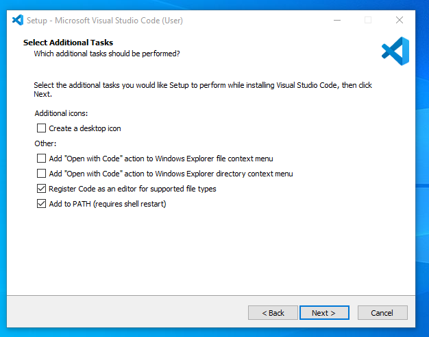
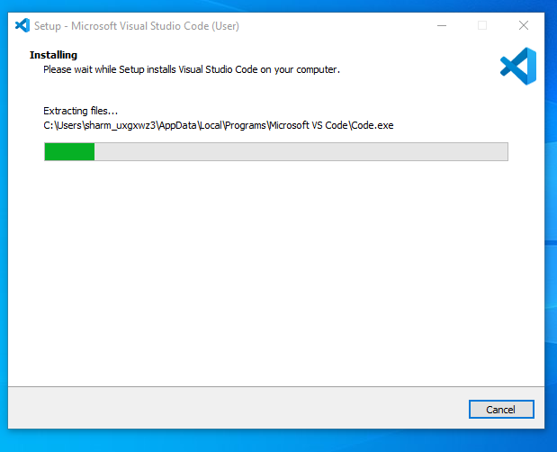
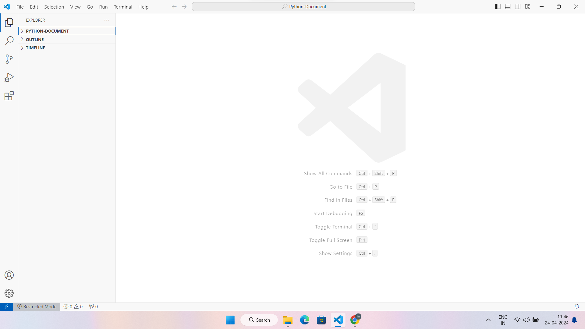

# LiaScript 

# Table of Content

- [Introduction of LiaScript](#introduction-of-liascript)

- [LiaScript Tools](#liascript-tools)

    - [Editing](#editing)

    - [Projects](#projects)

    - [Publishing](#publishing)

        - [LiaBooks](#liabooks)

        - [LiaTemplates](#liatemplates)

- [Math & Formulas](#math--formulas)

## Introduction of LiaScript

LiaScript is an innovative markup language that combines the simplicity of Markdown with the interactivity of HTML. It's primarily designed for creating educational content, particularly for online courses, tutorials, and interactive presentations. LiaScript allows you to seamlessly integrate text, code, multimedia elements, quizzes, and more into your documents.

## LiaScript Tools

As already mentioned all you need to work with LiaScript is an text-editor, but it can be usefull to apply one of the following tools. At least we apply them to see the result of a change within the course document immediately. You will see, that the development of online-courses will speed up, especially if there is no need for memorizing complex point and click sequences.

#### how install git

__Install Git on Windows__

Git for Windows stand-alone installer

1. Download the latest Git for [Windows installer](https://git-scm.com/downloads).

2. When you've successfully started the installer, you should see the **Git Setup** wizard screen. Follow the **Next** and **Finish** prompts to complete the installation. The default options are pretty sensible for most users.

3. Open a Command Prompt (or Git Bash if during installation you elected not to use Git from the Windows Command Prompt).

4. Run the following commands to configure your Git username and email using the following commands, replacing Emma's name with your own. These details will be associated with any commits that you create:

  >  $ git config --global user.name "`your Name`"

  >  $ git config --global user.email "`Your person email id`"

5. Optional: Install the Git credential helper on Windows

__Install Git for Mac Installer__

The easiest way to install Git on a Mac is via the stand-alone installer:

1. Download the latest [Git for Mac installer](https://sourceforge.net/projects/git-osx-installer/files/).

2. Follow the prompts to install Git.

3. Open a terminal and verify the installation was successful by typing `git --version:`

   $ git --version

   git version 2.9.2

4. Configure your Git username and email using the following commands, replacing Emma's name with your own. These details will be associated with any commits that you create:

    $ git config --global user.name "`Your Name`"

    $ git config --global user.email "`Your person Email id`"

__Install Git on Linux__

Debian / Ubuntu (apt-get)

Git packages are available via apt:

1. From your shell, install Git using apt-get:

    $ sudo apt-get update

    $ sudo apt-get install git

2. Verify the installation was successful by typing `git --version`:

    $ git --version

    git version 2.9.2

3. Configure your Git username and email using the following commands, replacing Emma's name with your own. These details will be associated with any commits that you create:

    $ git config --global user.name "`Your Name`"

    $ git config --global user.email "`Your person Email id`"

#### Steps to Install Visual Studio Code on Windows

1.Download the VS Code file from the automatically download [Official Website](https://code.visualstudio.com/docs/?dv=win).

2.Execute the download file.


3.Accept the Terms & Conditions.


4.Click on the Install button.



  - Then it will ask to begin the installation setup. Click on the Install button.


5.Wait for the installation to complete.

  - After clicking on Install, it will take about 1 minute to install the Visual Studio Code on your device.


  

6.Click on the Launch button to start it.

- After the Installation setup for Visual Studio Code is finished, it will show a window like this below. Tick the “Launch Visual Studio Code” checkbox and then click Next.


__how to install LiaScript__

1. Open Visual Studio Code



2. Go to the `Extensions` (or) Shortcut `(Ctrl+Shift+X)`  


3. Then Search bar click and type a `LiaScript-Perview` and install


### Editing


### Projects

                           --{{0}}--
The easiest way of importing a LiaScript into another website or
[Learning Management System (LMS)](https://en.wikipedia.org/wiki/Learning_management_system)
such as
[Moodle](https://en.wikipedia.org/wiki/Moodle),
[ILIAS](https://en.wikipedia.org/wiki/ILIAS), or
[OPAL](https://de.wikipedia.org/wiki/OPAL_%28Lernplattform%29), is via importing
an external website or if possible via an
[`iframe`](https://en.wikipedia.org/wiki/HTML_element#Frames).

!?[LiaScript embed into OPAL](https://www.youtube.com/watch?v=c97m2guiAeA "Movie: Screencast of a LiaScript course that is hosted via CodiLIA and imported as an external resource into OPAL.")


                             {{1}}
********************************************************************************

**LiaScript-Exporter:**

                           --{{1}}--
However, there might be cases where you want to store the progress within the
LMS. We therefor have developed an experimental exporter, which allows to bundle
your entire project as an
[SCORM](https://en.wikipedia.org/wiki/Sharable_Content_Object_Reference_Model)
compliant zip-file that can be imported into most common LMS. Other formats than
SCORM can be added too, simply write us a mail or create an issue, if you
require another one.

* npmjs: https://www.npmjs.com/package/@liascript/exporter
* GitHub: https://github.com/liascript/liascript-exporter

********************************************************************************


                             {{2}}
********************************************************************************

**Preview-Lia:**

                           --{{2}}--
If you want to refer to your own courses or to foreign ones on your personal
website or blog, you can make use of our "preview web component". This creates
preview cards, which are updated at client-side, so that there is no need to
manually update all information whenever there is a change in the course. Simply
add the `script` tag as depicted in the code-snippet and link to your courses
via the tag `preview-lia`.

``` html
<html>
  <head>
    <script type="text/javascript" src="https://liascript.github.io/course/preview-lia.js"></script>
  </head>
  <body>
    ...
    <preview-lia src="https://raw.githubusercontent.com/liaScript/docs/master/README.md">
    </preview-lia>

    <preview-lia src="https://liascript.github.io/course/?https://raw.githubusercontent.com/liaScript/docs/master/README.md">
    </preview-lia>

    ...
  </body>
</html>
```

> For more information visit the blog entry:
> [Markdown just got a new preview tag](https://aizac.herokuapp.com/markdown-just-got-a-new-preview-tag)
>
> _However, you can also use this to refer to your personal GitHub projects._

********************************************************************************


                           --{{3}}--
LiaScript was originally developed for supporting programming courses for
embedded systems. You can see an example of the previous eLab remote laboratory
installation.

                             {{3}}
!?[eLab demonstrator](https://www.youtube.com/watch?v=bICfKRyKTwE "**Movie:** A review on the historical eLab system, the predecessor to LiaScript.")

                           --{{4}}--
Now it is the opposite, our main focus lays in the development of the Markup
language, but parts of the old systems can still be used. Especially if you want
to teach programming in (_Java_, _C_, _C++_, _C#_, _Mono_, _Go_ and _Python_).
The CodeRunner is an open-source project that enables remote compiling and
execution of code. We apply it to teach procedural and object-oriented
programming. You can either host your own server or use our free herokuapp:

       {{4}}
> **CodeRunner:**
>
> * GitHub: https://github.com/liascript/CodeRunner
>
> * Try the interactive LiaScript version at:
>
>   https://liascript.github.io/course/?https://github.com/liascript/CodeRunner
>
> * Or if you want to import this functionality into your course, then add the
>   following statement into the main header of your LiaScript course:
>
>   `import: https://raw.githubusercontent.com/LiaScript/CodeRunner/master/README.md`

### Publishing

                           --{{0}}--
By now you should have a basic idea of what you can do with LiaScript, but
probably not how you can publish your courses. The best way is actually to use
[GitHub](https://github.com), this way no prior versions of your course get
lost, and you give others (you can even invite them) the opportunity to
contribute to your project.

                           --{{1}}--
No further hosting is required, no further compilation step, the JavaScript
interpreter of LiaScript does everything else directly within the browser at
client-side.

                           --{{2}}--
As you can see from the _example_, it is also possible to refer to a specific
slide. You only have to add a `#` with the number of the slide, or you can add
the name of the specific slide as well.

                           --{{3}}--
You can also add additional tags to your project to make it discoverable. We
currently use three distict categories: `liascript` to mark it to be related to
the projects, while the others `liascript-course` and `liascript-template` are
used to distinguish the projects into courses or extension, which can be added
to courses.

                           --{{4}}--
The same way you can also refer to courses that you have put into your
[DropBox](https://en.wikipedia.org/wiki/Dropbox_%28service%29),
[ownCloud](https://en.wikipedia.org/wiki/OwnCloud),
[NextCloud](https://en.wikipedia.org/wiki/Nextcloud), or if you have access to
some old-fashioned webspace then you can also store all of your files there. You
only have to make them publically available and to refer to the raw or in other
words, the text document. All other sources are loaded relative to this URL.

0. Create a free account at https://github.com
1. Refer to your projects as via a URL parameter:

   `https://LiaScript.github.io/course/?YOUR_RAW_COURSE_URL.md`

2. Example with reference to a specific slide:

   https://liascript.github.io/course/?https://raw.githubusercontent.com/liaScript/docs/master/README.md#5

3. Make your document discoverable by adding the tags `liascript` and or
   `liascript-course`, `liascript-template` to make it appear in one of the
   following GitHub topics:

   - general: https://github.com/topics/liascript
   - free courses: https://github.com/topics/liascript-course
   - extensions: https://github.com/topics/liascript-template

   _More information on tagging projects can be found [here](https://docs.github.com/en/repositories/managing-your-repositorys-settings-and-features/customizing-your-repository/classifying-your-repository-with-topics)._

4. Use other ways of hosting repositories as well (e.g.
   [DropBox](https://en.wikipedia.org/wiki/Dropbox_%28service%29),
   [ownCloud](https://en.wikipedia.org/wiki/OwnCloud),
   [NextCloud](https://en.wikipedia.org/wiki/Nextcloud)).

#### LiaBooks

                           --{{0}}--
However, we have no idea who is using LiaScript elsewhere, so it might be hard
to find some resources online. From time to time we translate open-books into
LiaScript and make them more interactive. You can see some of our the
experiments at the following URL and use them as a source of inspiration:

https://github.com/LiaBooks


> __Full overview on courses via the topic `liascript-course`:__
>
> https://github.com/topics/liascript-course


#### LiaTemplates

                           --{{0}}--
If you tried out CodeRunner, you will have probably noticed that you can reuse
functionality from different courses, simply by using the keyword `import:`
within the main definition of your LiaScript document. Such a functionality is
defined with the help of macros. We will dive deeper into this feature at the
end of this document, but if you are interested you can inspect some of our
templates, which shall provide self-explaining courses of how to embed and use
the implemented macros.

https://github.com/LiaTemplates


> __Full overview on extensions via the topic `liascript-template`:__
>
> https://github.com/topics/liascript-template

## Math & Formulas
             --{{0}}--
The following will not work on GitHub, but most Markdown-interpreters do support formulas with a LaTeX-like syntax. As it is common in many Markdown dialects, such as in Pandoc-Markdown, you can apply dollar signs to surround a "math"-environment. Everything within the dollar signs belongs to the formula only, there is currently no nesting of other HTML or LiaScript/Markdown allowed.

          --{{1}}--
Use single dollar signs to define an inline formula, which will be treated as an ordinary text element.

                      {{1}}
Inline math-mode $ \frac{a}{\sum{b+i}} $ -> $ \frac{a}{\sum{b+i}} $

         --{{2}}--
Use double dollar signs to indicate a formula-block. This way you can also use multiple lines to define a formula or a set of formulas that will furthermore be displayed larger.

                      {{2}}
Multi-line math-mode can be applied by double dollars $$ formula $$

 

                       --{{3}}--
Currently, we apply the KaTeX library for typesetting. If you are already familiar with LaTeX or MathJAX, as another alternative library, then you can start immediately to define formulas. If not, then check out some of the following resources.

     {{3}}
via KaTeX: http://katex.org

Supported functions:

https://katex.org/docs/supported.html

Alphabetically sorted features:

https://katex.org/docs/support_table.html

Detexify: get the appropriate command by drawing symbols

http://detexify.kirelabs.org/classify.html

           --{{4}}--
Sometimes it might be tedious to find the right, command for the intended symbol, if you can draw it, then you should give detexify a try.

Formula Playground
                      --{{0}}--
Alignment is a typical use case for formulas. The code below, shows how this can be achieved by using ampersands, which are used as an anchor for the center of a formula.

\begin{split}
  a &=b+c \\
    &=e+f \\
    &=g+h+i+j\\
a+b+&c+d=12\\
\end{split}
@runFormula

                      --{{1}}--
If you want to number your formulas, we recommend using the \tag command to add or overwrite the reference number. Automatic numbering does not work well at the moment, since the formulas are rendered within a web component, and it does conflict with the LiaScript idea of animation, which we describe in a later part of this series.

  {{1}}
\tag{33}
\begin{equation}
 a =b+c
\end{equation}
@runFormula

                      --{{2}}--
And finally it is possible to add some styling, but with KaTeX-functionalities, this includes some basic styling, with the same inline CSS, as we had described it in section Custom Styling. (Can you spot the strange looking german character Eszett.) And you can mark elements as links with \href and add images with the command \includegraphics.

  {{2}}
\begin{Bmatrix}
   a & b & c & d & e & f \\
   g & h & i & j & k & l \\
   m & n & o & p & q & r \\
   s & t & u & v & w & x \\
   y & z & ä & ö & ü &
   \htmlStyle{color: red; font-size: 26px}{ß}
\end{Bmatrix}
\\
\href{https://katex.org/docs/supported.html#html}{\KaTeX HTML support}
\\
\includegraphics[height=0.8em, totalheight=0.9em, width=0.9em, alt=KA logo]{https://katex.org/img/khan-academy.png}
@runFormula

Formula-Macros
             --{{0}}--
Additionally, you can define custom macros, as it is supported by KaTeX. However, there are currently two options to define macros, which can be either local or global.

   {{1}}
Local
  --{{1}}--
Local macros can be defined directly within the formula environment. Even if you use something like \gdef, which stands for global define, these macros will only affect the local formula. The reason for this is, that in contrast to other Markdown renderers, LiaScript will only parse and display the current slide/section. A global definition on slide 100 will not affect the formulas on slide 12.

Documentation: KaTeX-Macros

$ \def\foo{x^2} \foo + \foo $ --> $ \def\foo{x^2} \foo + \foo $

$ \gdef\bar#1{#1^2} \bar{y} + \bar{y} $ --> $ \gdef\bar#1{#1^2} \bar{y} + \bar{y} $

{{2}}
Global
--{{2}}--
However, if you want to define a custom set of macros and reuse them within all of your formulas, you will have to define them within the main comment of your document. Use the formula macro, whereby the first word defines the macro name (the starting backslash is optional) and the remainder is used as the body. All of these macros are then passed to every formula while rendering, see therefor the comments at:

KaTeX rendering options

<!--
author: ...

formula:  foo   {x^2}
formula:  \bar  {#1^2}

-->

# Main

$ \foo + \foo $

$ \bar{y} + \bar{y} $
$ \foo + \foo $ --> $ \foo + \foo $

$ \bar{y} + \bar{y} $ --> $ \bar{y} + \bar{y} $

{{3}}
Changing
--{{3}}--
Additionally, it is possible to overwrite global formulas or define new ones per slide. In the example below, the new formula definition for foo will be used, while bar remains as it is. However, if you switch to another slide, the previously global definition of foo is used again.

...

## Subsection
<!--
formula: \foo  {y^3}
-->

$ \bar{\foo} + \bar{\foo} $
{{4}}
Mixing global and local
--{{4}}--
Unfortunately, it is currently not possible to use both types of macros within one formula. If there are local macro definitions, then no global macros are passed. Thus, the following formula will result in an error, since the global \bar is not defined. Passing macros as rendering options and defining local ones currently result in KaTeX errors.

$ \def\foo{x^2} \bar{\foo} + \bar{\foo} $ $ --> \def\foo{x^2} \bar{\foo} + \bar{\foo} $
{{0}}
Footnotes
                        --{{0}}--
Before moving on to the LiaScript specific features, such as quizzes, surveys, animations, ASCII-art, etc., we would like present a last feature that is common to many Markdown dialects and these are footnotes. So, what are footnotes in general and when to use them.

                        {{0-1}}
{{|> UK English Male}}
Footnotes are notes at the foot of the page while endnotes are collected under a separate heading at the end of a chapter, volume, or entire work. Unlike footnotes, endnotes have the advantage of not affecting the layout of the main text, but may cause inconvenience to readers who have to move back and forth between the main text and the endnotes.

-- Wikipedia

                      --{{1}}--
In LiaScript a "section", which is defined by a header and a body, resembles a page. Thus, the body might contain a couple of footnote-marks, while the actual footnotes have to be defined at the end of the body. Other Markdown interpreters might define a more "wide-spread" usage of footnotes, but in LiaScript this is not possible at the moment. We parse/interpret only one section at a time and not the entire document. So keep this in mind when using footnotes.

### header 3

body

body

body

footnotes

## ...


Standard-Footnotes
                   --{{0}}--
The standard way of creating footnotes is to attach a marker to important elements within your sections. A marker is defined by brackets with a starting ^. Then you can insert numbers, symbols and words.

           <!-- class="translate"-->
Something[^1] important[^2] about[^🦶] notes.
                      --{{1}}--
At the end of your body, you simply add a list with all indented remarks you want to add. This list starts with your markers, that are followed by a colon. Your notes or footnote-bodies can consist of multiple paragraphs and all other block-elements that you have mentioned so far, but they have to be indented with at least 2 spaces.

                        {{1}}
            <!-- class="translate"-->

[^1]: **Something** and **anything** are concepts of existence in ontology,
  contrasting with the concept of nothing. Both are used to describe the
  understanding that what exists is not nothing without needing to address the
  existence of everything. The philosopher, David Lewis, has pointed out that
  these are necessarily vague terms, asserting that "ontological ...

  -- [Wikipedia](https://en.wikipedia.org/wiki/Something_%28concept%29)

[^2]:> It is **important** to mention that anything can be added to a footnote
  > also some piece of code, images, videos, etc.
  >
  > [How to Use Footnotes](https://www.youtube.com/watch?v=Gg6vXoHO95I)

[^🦶]: Actually you are not forced to use numbers, you can use any kind of
       symbol or even words too.

       _But, please be consise._
                      --{{2}}--
By clicking onto the footnote, all of your comments will be shown in a modal view in all view-modes. If you are in "textbook" mode, then these footnotes are additionally displayed at the very end of the current "page".

                        {{2}}
Result:

Something1 important2 about3 notes.

-- Wikipedia

also some piece of code, images, videos, etc.

??How to Use Footnotes

Inline-Footnotes
                      --{{0}}--
The following idea of defining inline-footnotes was borrowed from LaTeX. If you want to add only some text without further Markdown-syntax then you can add this in parentheses to your footnote-mark. In this case it is not necessary to add a more sophisticated explanation to the end of the sections.

Inline Footnote [^x](__explanation__ in one line) => Inline Footnote[^x](explanation in one line)