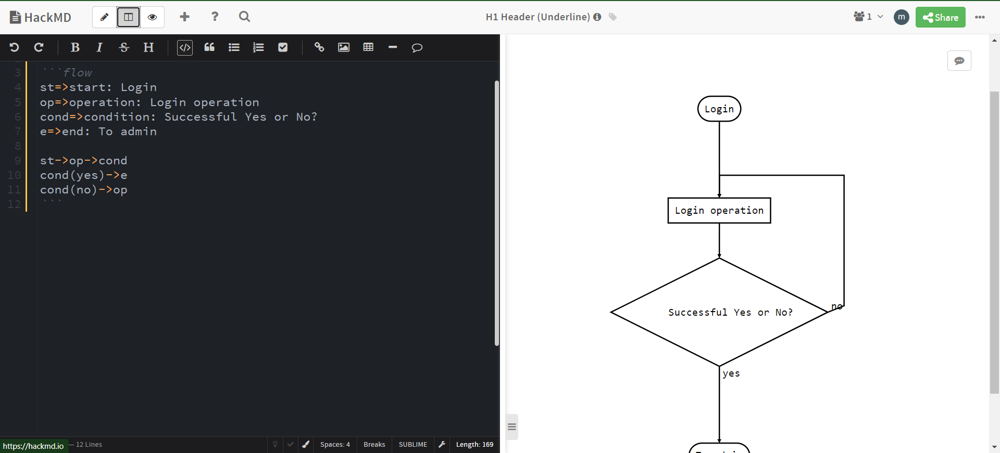
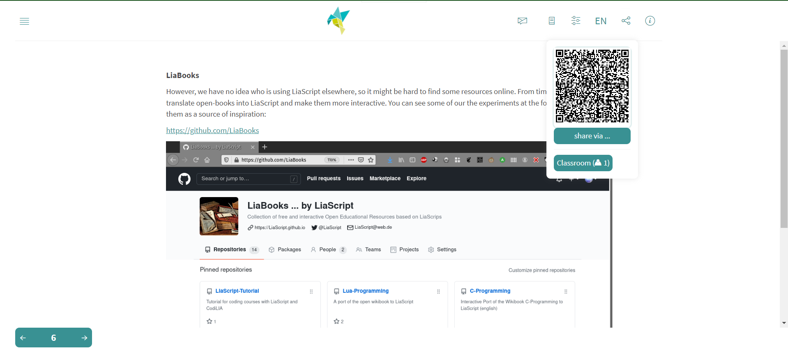

<!--

author:   André Dietrich
email:    LiaScript@web.de
date:     05/03/2024
version:  27.0.0
language: en
narrator: UK English Female

repository: https://github.com/LiaScript/docs

logo:     https://liascript.github.io/img/bg-showcase-1.jpg

comment:  This document shall provide an entire compendium and course on the
          development of Open-courSes with [LiaScript](https://LiaScript.github.io).
          As the language and the systems grows, also this document will be updated.
          Feel free to fork or copy it, translations are very welcome...

script:   https://cdn.jsdelivr.net/chartist.js/latest/chartist.min.js
          https://felixhao28.github.io/JSCPP/dist/JSCPP.es5.min.js

link:     https://cdn.jsdelivr.net/chartist.js/latest/chartist.min.css

link:     https://cdnjs.cloudflare.com/ajax/libs/animate.css/4.1.1/animate.min.css

import:   https://raw.githubusercontent.com/liaTemplates/ABCjs/main/README.md

link:     https://fonts.googleapis.com/css2?family=Noto+Sans+Egyptian+Hieroglyphs
          https://fonts.googleapis.com/css2?family=Noto+Sans+Ogham

font:     Noto Sans Egyptian Hieroglyphs, Noto Sans Ogham
-->


# LiaScript 

# Table of Content


  - [Introduction of LiaScript](#introduction-of-liascript)
  - [LiaScript Tools](#liascript-tools)
    - [Editing](#editing)
      - [LiaScript-DevServer](#liascript-devserver)
      - [CodiLIA:](#codilia)
    - [Projects](#projects)
      - [LiaScript-Exporter](#LiaScript-Exporter)
    - [Publishing](#publishing)
      - [LiaBooks](#liabooks)
      - [LiaTemplates](#liatemplates)
  - [Math & Formulas](#math--formulas)
      - [Main](#main)
      - [Subsection](#subsection)
  - [Footnotes](#footnotes)
  - [Standard-Footnotes](#standard-footnotes)
  - [Inline Footnotes](#inline-footnotes)
  - [Surveys & classrooms](#surveys--classrooms)
  - [ASCII](#ASCII)
      - [Svgbob](#Svgbob)
      - [Boxes](#Boxes)
      - [Arrows & Connectors](#arrows--connectors)
      - [More Shapes](#More-Shapes)
      - [Box Drawing](#box-drawing)
      - [Emojis](#Emojis)
    - [Styling ASCII](#styling-ascii)
    - [Adding Titles](#Adding-Titles)
    - [Embedding LiaScripts](#embedding-liascripts)
      - [1.Animations](#1-animations)
      - [2.Animations with TTS](#2-animations-with-tts)
      - [3.Quizzes](#3-quizzes)
      - [4.Working with macro](#4-working-with-macros)
    - [Macros](#macros)
        - [1. Macro Basics](#1-macro-basics)
        - [2. Basic macros](#2-basic-macros)

## Introduction of LiaScript

LiaScript is an innovative markup language that combines the simplicity of Markdown with the interactivity of HTML. It's primarily designed for creating educational content, particularly for online courses, tutorials, and interactive presentations. LiaScript allows you to seamlessly integrate text, code, multimedia elements, quizzes, and more into your documents.

## LiaScript Tools

As already mentioned all you need to work with LiaScript is an text-editor, but it can be usefull to apply one of the following tools. At least we apply them to see the result of a change within the course document immediately. You will see, that the development of online-courses will speed up, especially if there is no need for memorizing complex point and click sequences.

### Editing
 
 #### how install git

__Install Git on Windows__

Git for Windows stand-alone installer

1. Download the latest Git for [Windows installer](https://git-scm.com/downloads).

2. When you've successfully started the installer, you should see the **Git Setup** wizard screen. Follow the **Next** and **Finish** prompts to complete the installation. The default options are pretty sensible for most users.

3. Open a Command Prompt (or Git Bash if during installation you elected not to use Git from the Windows Command Prompt).

4. Run the following commands to configure your Git username and email using the following commands, replacing Emma's name with your own. These details will be associated with any commits that you create:

  >  $ git config --global user.name "`your Name`"

  >  $ git config --global user.email "`Your person email id`"

5. Optional: Install the Git credential helper on Windows

__Install Git for Mac Installer__

The easiest way to install Git on a Mac is via the stand-alone installer:

1. Download the latest [Git for Mac installer](https://sourceforge.net/projects/git-osx-installer/files/).

2. Follow the prompts to install Git.

3. Open a terminal and verify the installation was successful by typing `git --version:`

   $ git --version

   git version 2.9.2

4. Configure your Git username and email using the following commands, replacing Emma's name with your own. These details will be associated with any commits that you create:

    $ git config --global user.name "`Your Name`"

    $ git config --global user.email "`Your person Email id`"

__Install Git on Linux__

Debian / Ubuntu (apt-get)

Git packages are available via apt:

1. From your shell, install Git using apt-get:

    $ sudo apt-get update

    $ sudo apt-get install git

2. Verify the installation was successful by typing `git --version`:

    $ git --version

    git version 2.9.2

3. Configure your Git username and email using the following commands, replacing Emma's name with your own. These details will be associated with any commits that you create:

    $ git config --global user.name "`Your Name`"

    $ git config --global user.email "`Your person Email id`"

#### Steps to Install Visual Studio Code on Windows

1.Download the VS Code file from the automatically download [Official Website](https://code.visualstudio.com/docs/?dv=win).

2.Execute the download file.


3.Accept the Terms & Conditions.


4.Click on the Install button.


  - Then it will ask to begin the installation setup. Click on the Install button.


5.Wait for the installation to complete.

  - After clicking on Install, it will take about 1 minute to install the Visual Studio Code on your device.


  

6.Click on the Launch button to start it.

- After the Installation setup for Visual Studio Code is finished, it will show a window like this below. Tick the “Launch Visual Studio Code” checkbox and then click Next.


__how to install LiaScript__

1. Open Visual Studio Code

 

2. Go to the `Extensions` (or) Shortcut `(Ctrl+Shift+X)`  

 

3. Then Search bar click and type a `LiaScript-Perview` and all liascript install

 

4. install `LiaScript-Snippets` Details Scrolldown line of code copy

]

5. To enable this snippet, you have to add the following configuration to your `settings.json` ... Simply hit "`Ctrl-Shift-P`" and then type settings file Paste and save.
  - Shortcut Key `Ctrl-Shift-P`


- Search bar type to `Setting.Json` 


- setting file open copy the code Paste file and Save then close and reopen 


#### LiaScript-DevServer

This project is intended to support the development of interactive courses with LiaScript. This projects implements a development server that can be used locally to preview courses within the browser.

##### __Install__

You can directly download the latest version for your system from the assets:

 Python Software : https://github.com/LiaScript/LiaScript-DevServer/releases/

##### __NodeJS__
If you haven't installed it yet, you will have to install NodeJS for your system. This is the actual runtime environment for your local server and also contains the package manager that we will need for installing the LiaScript-DevServer.

https://nodejs.org/en/download/

LiaScript-DevServer
Open the terminal on your system and type the following command.

    npm install -g @liascript/devserver

__Usage__

You can run the devServer by typing `liascript-devserver` or the short-cut `liadev` into your terminal. The following command will print out some help information on command-line parameters that you can use:
```text
  liascript-devserver --help
```
```text    
   _     _       ____            _       _
  | |   (_) __ _/ ___|  ___ _ __(_)_ __ | |_
  | |   | |/ _` \___ \ / __| '__| | '_ \| __|
  | |___| | (_| |___) | (__| |  | | |_) | |_
  |_____|_|\__,_|____/ \___|_|  |_| .__/ \__|
                                  |_|

  -h  --help       show this help
  -v  --version    show version information
  -i  --input      input README.md file or folder (default: .)
  -p  --port       used port number (default: 3000)
  -l  --live       do live reload on file change
  -o  --open       open in default browser
  -t  --test       test online on https://LiaScript.github.io

  -r  --responsiveVoice  add optional responsiveVoice support,
                        or pass your own responsiveVoice key.
                        Adding this feature might slow down
                        the reloading speed.
                        For more information visit:

```
> **Note:** `-h` or `--help` will only print out the help, all other parameters are ignored.

### `--version`

Use this to identify the current version, but you can alternatively also use the
shortcut `-v`:

```bash
liascript-devserver --version
```

At the moment this should give the following results. Since LiaScript gets
updated separately, we use two different version, one for the devServer and one
for LiaScript.

```text
DevServer: 1.1.11
LiaScript: 0.14.11
```

### `--input`

If you run the command `liascript-devserver` without any commands, the server
will run from your current directory and give you the following output.

```text
$ liascript-devserver

 _     _       ____            _       _
| |   (_) __ _/ ___|  ___ _ __(_)_ __ | |_
| |   | |/ _  \___ \ / __| '__| | '_ \| __|
| |___| | (_| |___) | (__| |  | | |_) | |_
|_____|_|\__,_|____/ \___|_|  |_| .__/ \__|
                                |_|

📡 starting server
   - local:           http://localhost:3000
   - on your network: http://192.168.2.114:3000
✨ hit Ctrl-c to close the server
```

The server starts locally on port 3000, thus, if you open your browser and type
in the URL http://localhost:3000 you should see a similar image


However, if you add the `--input` parameter (shortcut `-i`) and pass it another
folder, this will be used as the root folder for the subsequent navigation.

```bash
liascript-devserver --input ../LiaBooks
```

But you can also refer to a specific Markdown file, in this case, the course
will be rendered immediately by the LiaScript interpreter, if you open the
following link in your browser.

```bash
liascript-devserver --input ../LiaBooks/docs/README.md

...
📡 starting server
   - local:           http://localhost:3000/liascript/index.html?http://localhost:3000/README.md
   - on your network: http://192.168.2.114:3000/liascript/index.html?http://192.168.2.114:3000/README.md
✨ hit Ctrl-c to close the server
```


### `--open`

**If you want to open the preview immediately, then use this parameter.** It
will open your default browser with the displayed URL automatically.

```bash
liascript-devserver --open -i ../LiaBooks
```

### `--live`

Use this parameter if you want to have live updates. The server will monitor
file changes within the defined folder. When you type and save your document, a
reload will be automatically triggered. If you prefer to reload your changes
manually via pressing `F5` do not use this option.

```bash
liascript-devserver --live -o -i ../LiaBooks/docs/README.md
```


### `--port`

It is only possible to run on devServer at a given port-number, thereby 3000 is
used as the default value. If you want to start multiple servers on different
folders or the port-number is already occupied by another process or server,
this will will be shown by the following error message:

```bash
liascript-devserver -o -i ../LiaBooks

...
📡 starting server
   - local:           http://localhost:3000/liascript/index.html?http://localhost:3000/README.md
   - on your network: http://192.168.2.114:3000/liascript/index.html?http://192.168.2.114:3000/README.md
✨ hit Ctrl-c to close the server
🚨 error => listen EADDRINUSE: address already in use :::3000
```

However, by using `--port 3001` or `-p 3001` you can redefine this number and
run different servers separately:

```bash
liascript-devserver --port 3001 -o -i ../LiaBooks

...
📡 starting server
   - local:           http://localhost:3001/liascript/index.html?http://localhost:3001/README.md
   - on your network: http://192.168.2.114:3001/liascript/index.html?http://192.168.2.114:3001/README.md
✨ hit Ctrl-c to close the server
```

### `--test`

Since we are using a local devServer, it is also possible to test your courses
online on the LiaScript project website: https://LiaScript.github.io

See how the URL changes by setting the parameter `--test`:

```bash
liascript-devserver --test -o -i ../LiaBooks/docs/README.md

...
📡 starting server
   - local:           https://LiaScript.github.io/course/?http://localhost:3000/README.md
   - on your network: https://LiaScript.github.io/course/?http://192.168.2.114:3000/README.md
✨ hit Ctrl-c to close the server
```

> **Note:** Live reload with `--live` will not work in this mode, since the
> server is only used to serve local data and not the LiaScript website.
> Additionally you will have to remove the courses manually from the index.

### `--responsiveVoice`

Automated Text2Speech is **Not** enabled by default, since it reduces the reload
speed. But you can add this support by add this parameter, in this case the
LiaScript project key is automatically injected. However, you can also pass your
own key from your own project/website like this:

```bash
$ liascript-devserver --responsiveVoice YOURKEY -i ../LiaBooks
```

#### __CodiLIA__:

CodiLIA lets you collaborate in real-time to create interactive online courses with LiaScript. Built on HackMD source code, CodiLIA lets you host and control your course content with speed and ease.  

##### __Note Editor__

- Understanding Your Editor

  1. __CodiMD Logo Brand Logo__ 
  
      click the logo can goto homepage [webpage link](https://hackmd.io/?nav=overview).
  
  2. __Editor Mode Switcher__

      You can change workspace layout by click the button. there has three type of layout. 

      - ✏️	 Edit: See only the editor.

          

      - 👁️	 View: See only the result.

          

      - 🤲  Both: See both in split view.

          

  3. __Night Theme Switcher__

      You can click this button to change the whole workspace theme to Night Theme or Normal Theme.

       - Night Theme

  

  4. __Help Button__

      Clicking Help Button to view quick tips about Markdown Syntax.

  

  5. __Upload Image Button__

      Clicking this button to select an image to upload into CodiMD. The image backend service is depends on your server configuration CMD_IMAGE_UPLOAD_TYPE. The default settings is upload to imgur via anonymous.

  6. __Last Change Time and Username__

      This area display the documentation last changed time and last changed user.

  7. __New Note Button__

      Clicking this button to create new CodiMD note on new browser tab.

  8. __Publish Button__

      Clicking this button to open a new tab in browser that showing the note in published mode.

  9. __Note Menu__

  

  10. __Online Indicator__

  


  11. __Permission and Note Deletion button__

  

  13. __Table of Contnet__

  

  14. __Editor Shortcut Profile__

      CodiMD supports three type keyboard shortcut profile.

      - Sublime
      - Emacs
      - Vim

  15. __Space/Tab Indent Switch__

      You can clicking this button to switch between space and tab mode in you type TAB key in editor.

  16. __Editor Color Theme__

      - Light
      - One Dark (Default)
      - Monokai
      - Solarized Dark
      - Solarized Light
      - Dracula
      - Material
      - Nord
      - Panda
      - Ayu Dark
      - Ayu Mirage
      - Tomorror Night Bright
      - Tomorror Night Eighties

  17. __Spell Check__

      Clicking this button to enable spell check. We support four languages:

       = English (United States)
       - German
       - German (Austria)
       - German (Switzerland)

  18. __Markdown List__

      Clicking this button to enable Markdown Lint. You can check this page for more [markdown list](https://github.com/markdownlint/markdownlint/blob/main/docs/RULES.md)

  19. __Editor Cursor Indicator__

      This area shows cursor information about current cursor. It's contains

       - current line number
       - current cursor column
       - total line numbers


### Projects

__Learning Management System (LMS)__

A learning management system (LMS) or virtual learning environment (VLE) is a software application for the administration, documentation, tracking, reporting, automation, and delivery of educational courses, training programs, materials or learning and development programs.

__Moodle__

  Moodle is a free and open-source learning management system written in PHP and distributed under the GNU General Public License.Moodle is used for blended learning, distance education, flipped classroom and other online learning projects in schools, universities, workplaces and other sectors.

#### LiaScript-Exporter

His shall be a generic LiaScript-Exporter that can export educational content into different formats, so that LiaScript courses can also be utilized in different Learning Management Systems (LMS) or Readers for static content (PDF, ePub, ...). At the moment there is only support for SCORM1.2, as the most wide-spread exchange format. See the last section 


**Preview-Lia**

If you want to refer to your own courses or to foreign ones on your personal website or blog, you can make use of our "preview web component". This creates preview cards, which are updated at client-side, so that there is no need to manually update all information whenever there is a change in the course. Simply add the `script` tag as depicted in the code-snippet and link to your courses via the tag `preview-lia`.

Currently there are 5 different options, which you can either activate by `ctrl+shift+p` and then type "liascript" or you use one of the following short-cuts:

Start the development server in live mode: `alt+l` - on Mac `cmd+l`

This option will start the server in the current directory and watch for changes. Every time a file is changed and saved, the preview will be reloaded automatically. If no file has been selected previously, then you will be presented with a folder overview, where you can open different files.

Start the development server: [`alt+shift+l`] - on Mac [`cmd+shift+l`]

If automatically reloading might be annoying, you can use this option. It will only start the development and you will have to perform a reload of the course manually within the browser.

Start the development server and test your course on the project-website:

Text to speech is not enabled at the moment, but if you want to test your course on the LiaScript project-website this option can be used.

Stop the development server: [`alt+l+c`] - on Mac [`cmd+l+c`]

Once the server has been started, it will remain active until you close VScode or by using this command.

Navigation:

from Preview to file: Simply by double-clicking onto an element on the slide
from cursor position to Preview: [`ctrl+click`] ... which means, simply press control and click with the mouse onto the position in the editor, which you want see at the preview


### Publishing
                       --{{0}}--
By now you should have a basic idea of what you can do with LiaScript, but probably not how you can publish your courses. The best way is actually to use GitHub, this way no prior versions of your course get lost, and you give others (you can even invite them) the opportunity to contribute to your project.

                       --{{1}}--

No further hosting is required, no further compilation step, the JavaScript interpreter of LiaScript does everything else directly within the browser at client-side.

                       --{{2}}--

As you can see from the example, it is also possible to refer to a specific slide. You only have to add a `#` with the number of the slide, or you can add the name of the specific slide as well.

                       --{{3}}--

You can also add additional tags to your project to make it discoverable. We currently use three distict categories: `liascript` to mark it to be related to the projects, while the others `liascript-course` and `liascript-template` are used to distinguish the projects into courses or extension, which can be added to courses.

                       --{{4}}--

The same way you can also refer to courses that you have put into your DropBox, ownCloud, NextCloud, or if you have access to some old-fashioned webspace then you can also store all of your files there. You only have to make them publically available and to refer to the raw or in other words, the text document. All other sources are loaded relative to this URL.

  1. Create a free account at https://github.com

  2. Refer to your projects as via a URL parameter:

      https://LiaScript.github.io/course/?MAIN.md

  3. Example with reference to a specific slide:

   > https://liascript.github.io/course/?
   
   > https://raw.githubusercontent.com/liaScript/docs/master/README.md#5

  4. Make your document discoverable by adding the tags liascript and or liascript-course, liascript-template to make it appear in one of the following GitHub topics:

  - general: https://github.com/topics/liascript

  - free courses: https://github.com/topics/liascript-course

  - extensions: https://github.com/topics/liascript-template

#### LiaBooks

However, we have no idea who is using LiaScript elsewhere, so it might be hard to find some resources online. From time to time we translate open-books into LiaScript and make them more interactive. You can see some of our the experiments at the following URL and use them as a source of inspiration: 

#### LiaTemplates

If you tried out CodeRunner, you will have probably noticed that you can reuse functionality from different courses, simply by using the keyword import: within the main definition of your LiaScript document. Such a functionality is defined with the help of macros. We will dive deeper into this feature at the end of this document, but if you are interested you can inspect some of our templates, which shall provide self-explaining courses of how to embed and use the implemented macros.

##### Computer Algebra

  __Algebra__

  Algebrite is a Javascript library for symbolic mathematics (technically, CoffeeScript) designed to be comprehensible and easily extensible.

  Features: arbitrary-precision arithmetic, complex quantities, simplification, expansion , substitution, symbolic and numeric roots, units of measurement, matrices, derivatives and gradients, tensors, integrals, multi-integrals, computing integrals and much more!

  `@Algebrite.eval`

  ``` Maxima
  (3 * x - 5x)^3 * (x + x)

  60!
  ```
  @Algebrite.eval

  The following example might take a few seconds ...

  ```Maxima
  f=sin(t)^4-2*cos(t/2)^3*sin(t)

  f=circexp(f)

  defint(f,t,0,2*pi)
  ```
  __Diagrams & Graphs__

    - Vega
      Vega-Lite is a high-level grammar of interactive graphics. It provides a concise JSON syntax for rapidly generating visualizations to support analysis. Vega-Lite specifications can be compiled to Vega specifications.

      `@Vega.exec`

                         --{{0}}--
    Simply call the macro `@Vega.exec` below your JSON snippet to make the code directly executable and editable:


```json
{
  "$schema": "https://vega.github.io/schema/vega-lite/v4.json",
  "data": {"url": "https://vega.github.io/vega-lite/examples/data/seattle-weather.csv"},
  "mark": "tick",
  "encoding": {
    "x": {"field": "precipitation", "type": "quantitative"}
  }
}
```
@Vega.exec

---

```json
{
  "$schema": "https://vega.github.io/schema/vega-lite/v4.json",
  "data": {
    "values": [
      {"a": "C", "b": 2},
      {"a": "C", "b": 7},
      {"a": "C", "b": 4},
      {"a": "D", "b": 1},
      {"a": "D", "b": 2},
      {"a": "D", "b": 6},
      {"a": "E", "b": 8},
      {"a": "E", "b": 4},
      {"a": "E", "b": 7}
    ]
  },
  "mark": "bar",
  "encoding": {
    "y": {"field": "a", "type": "nominal"},
    "x": {
      "aggregate": "average",
      "field": "b",
      "type": "quantitative",
      "axis": {
        "title": "Average of b"
      }
    }
  }
}
```
@Vega.exec


## `@Vega.run`

                         --{{0}}--
Use `@Vega.run` to immediately render your JSON snippet, without showing its
content to the user. Therefor, simply the macro to the head of your Markdown
snippet.


```json @Vega.run
{
  "$schema": "https://vega.github.io/schema/vega-lite/v4.json",
  "data": {"url": "https://vega.github.io/vega-lite/examples/data/seattle-weather.csv"},
  "mark": "tick",
  "encoding": {
    "x": {"field": "precipitation", "type": "quantitative"}
  }
}
```

---

```json @Vega.run
{
  "$schema": "https://vega.github.io/schema/vega-lite/v4.json",
  "data": {
    "values": [
      {"a": "C", "b": 2},
      {"a": "C", "b": 7},
      {"a": "C", "b": 4},
      {"a": "D", "b": 1},
      {"a": "D", "b": 2},
      {"a": "D", "b": 6},
      {"a": "E", "b": 8},
      {"a": "E", "b": 4},
      {"a": "E", "b": 7}
    ]
  },
  "mark": "bar",
  "encoding": {
    "y": {"field": "a", "type": "nominal"},
    "x": {
      "aggregate": "average",
      "field": "b",
      "type": "quantitative",
      "axis": {
        "title": "Average of b"
      }
    }
  }
}
```

 __Implementation__

                         --{{0}}--
The delay is currently required, to deal with the loading delay of the all
JavaScript files. This will be fixed in the next version of LiaScript.

````html
script:   https://cdn.jsdelivr.net/npm/vega@5.9.0
          https://cdn.jsdelivr.net/npm/vega-lite@4.0.2
          https://cdn.jsdelivr.net/npm/vega-embed@6.2.1

@Vega.exec: @Vega.exec_(@uid)

@Vega.exec_
<script>
  let vlSpec = @input
  vegaEmbed('#vis@0', vlSpec);
  "LIA: stop"
</script>

<div id="vis@0"></div>

@end

@Vega.run: @Vega.run_(@uid,```@0```)

@Vega.run_
<div id="vis@0"></div>

<script>
  setTimeout(function(e) {
    let vlSpec = @1
    vegaEmbed('#vis@0', vlSpec)
  }, 1000);
</script>

@end
````

                         --{{1}}--
If you want to minimize loading effort in your LiaScript project, you can also
copy this code and paste it into your main comment header, see the code in the
raw file of this document.

## Math & Formulas

Anything between two $ characters will be treated as TeX math. The opening $ must have a non-space character immediately to its right, while the closing $ must have a non-space character immediately to its left, and must not be followed immediately by a digit. Thus, $20,000 and $30,000 won’t parse as math. If for some reason you need to enclose text in literal $ characters, backslash-escape them and they won’t be treated as math delimiters.

For display math, use $$ delimiters. (In this case, the delimiters may be separated from the formula by whitespace. However, there can be no blank lines between the opening and closing $$ delimiters.)

TeX math will be printed in all output formats. How it is rendered depends on the output format

Example 

  1. **LaTeX**
      This introductory tutorial does not assume any prior experience of LATEX but, hopefully, by the time you are finished, you will not only have written your first LATEX document but also acquired sufficient knowledge and confidence to take the next steps toward LATEX proficiency.

    \documentclass{article}
    \begin{document}
    First document. This is a simple example, with no 
    extra parameters or packages included.
    \end{document}

  2. Markdown, Emacs Org mode, ConTeXt, ZimWiki

    It will appear verbatim surrounded by $...$ (for inline math) or $$...$$ (for display math).

  3. XWiki

    It will appear verbatim surrounded by {{formula}}..{{/formula}}.

  4. reStructuredText

    It will be rendered using an interpreted text role :math:.

  5. AsciiDoc

    For AsciiDoc output math will appear verbatim surrounded by latexmath:[...]. For asciidoc_legacy the bracketed material will also include inline or display math delimiters.

  6. Texinfo

    It will be rendered inside a @math command.

  7. roff man, Jira markup

    It will be rendered verbatim without $’s.

  8. MediaWiki, DokuWiki

    It will be rendered inside <math> tags.
  9. Textile

    It will be rendered inside <span class="math"> tags.

  10. RTF, OpenDocument

    It will be rendered, if possible, using Unicode characters, and will otherwise appear verbatim.

  11. ODT

    It will be rendered, if possible, using MathML.

  12. DocBook

    If the --mathml flag is used, it will be rendered using MathML in an inlineequation or informalequation tag. Otherwise it will be rendered, if possible, using Unicode characters.

  13. Docx and PowerPoint

    It will be rendered using OMML math markup.

  14. FictionBook2

    If the --webtex option is used, formulas are rendered as images using CodeCogs or other compatible web service, downloaded and embedded in the e-book. Otherwise, they will appear verbatim.

  15. HTML, Slidy, DZSlides, S5, EPUB
  
    The way math is rendered in HTML will depend on the command-line options selected. Therefore see Math rendering in HTML above.
  
### Formula Playground

                      --{{0}}--

Alignment is a typical use case for formulas. The code below, shows how this can be achieved by using ampersands, which are used as an anchor for the center of a formula.

\begin{split}
  a &=b+c \\
    &=e+f \\
    &=g+h+i+j\\
a+b+&c+d=12\\
\end{split}
@runFormula

                      --{{1}}--

If you want to number your formulas, we recommend using the \tag command to add or overwrite the reference number. Automatic numbering does not work well at the moment, since the formulas are rendered within a web component, and it does conflict with the LiaScript idea of animation, which we describe in a later part of this series.

  {{1}}

\tag{33}
\begin{equation}
 a =b+c
\end{equation}
@runFormula

                      --{{2}}--

And finally it is possible to add some styling, but with KaTeX-functionalities, this includes some basic styling, with the same inline CSS, as we had described it in section Custom Styling. (Can you spot the strange looking german character Eszett.) And you can mark elements as links with \href and add images with the command \includegraphics.

  {{2}}

\begin{Bmatrix}
   a & b & c & d & e & f \\
   g & h & i & j & k & l \\
   m & n & o & p & q & r \\
   s & t & u & v & w & x \\
   y & z & ä & ö & ü &
   \htmlStyle{color: red; font-size: 26px}{ß}
\end{Bmatrix}
\\
\href{https://katex.org/docs/supported.html#html}{\KaTeX HTML support}
\\
\includegraphics[height=0.8em, totalheight=0.9em, width=0.9em, alt=KA logo]{https://katex.org/img/khan-academy.png}
@runFormula

### Formula-Macros

             --{{0}}--

Additionally, you can define custom macros, as it is supported by KaTeX. However, there are currently two options to define macros, which can be either local or global.

   {{1}}

__Local__

  --{{1}}--

Local macros can be defined directly within the formula environment. Even if you use something like \gdef, which stands for global define, these macros will only affect the local formula. The reason for this is, that in contrast to other Markdown renderers, LiaScript will only parse and display the current slide/section. A global definition on slide 100 will not affect the formulas on slide 12.

Documentation: KaTeX-Macros

$ \def\foo{x^2} \foo + \foo $ --> $ \def\foo{x^2} \foo + \foo $

$ \gdef\bar#1{#1^2} \bar{y} + \bar{y} $ --> $ \gdef\bar#1{#1^2} \bar{y} + \bar{y} $

{{2}}

__Global__

--{{2}}--

However, if you want to define a custom set of macros and reuse them within all of your formulas, you will have to define them within the main comment of your document. Use the formula macro, whereby the first word defines the macro name (the starting backslash is optional) and the remainder is used as the body. All of these macros are then passed to every formula while rendering, see therefor the comments at:

KaTeX rendering options

<!--
author: ...

formula:  foo   {x^2}
formula:  \bar  {#1^2}

-->

### **Main**

$ \foo + \foo $

$ \bar{y} + \bar{y} $
$ \foo + \foo $ --> $ \foo + \foo $

$ \bar{y} + \bar{y} $ --> $ \bar{y} + \bar{y} $

H<sub>2</sub>O

X<sup>2</sup>+ Y<sup>3</sup> ---> $ \bar(x) + \bar(y) $

{{3}}

Changing

--{{3}}--

Additionally, it is possible to overwrite global formulas or define new ones per slide. In the example below, the new formula definition for foo will be used, while bar remains as it is. However, if you switch to another slide, the previously global definition of foo is used again.

...

### Subsection
<!--
formula: \foo  {y^3}
-->

$ \bar{\foo} + \bar{\foo} $

{{4}}

Mixing global and local

--{{4}}--

Unfortunately, it is currently not possible to use both types of macros within one formula. If there are local macro definitions, then no global macros are passed. Thus, the following formula will result in an error, since the global \bar is not defined. Passing macros as rendering options and defining local ones currently result in KaTeX errors.

$ \def\foo{x^2} \bar{\foo} + \bar{\foo} $ $ --> \def\foo{x^2} \bar{\foo} + \bar{\foo} $

## Footnotes 

Before moving on to the LiaScript specific features, such as quizzes, surveys, animations, ASCII-art, etc., we would like present a last feature that is common to many Markdown dialects and these are footnotes. So, what are footnotes in general and when to use them.

    {{|> UK English Male}}

In computing, a database is an organized collection of data or a type of data store based on the use of a database management system (DBMS), the software that interacts with end users, applications, and the database itself to capture and analyze the data. The DBMS additionally encompasses the core facilities provided to administer the database. The sum total of the database, the DBMS and the associated applications can be referred to as a database system. Often the term "database" is also used loosely to refer to any of the DBMS, the database system or an application associated with the database.

--[Wikipedia](https://en.wikipedia.org/wiki/Database)

In LiaScript a "section", which is defined by a header and a body, resembles a
page. Thus, the body might contain a couple of footnote-marks, while the actual
footnotes have to be defined at the end of the body. Other Markdown interpreters
might define a more "wide-spread" usage of footnotes, but in LiaScript this is
not possible at the moment. We parse/interpret only one section at a time and
not the entire document. So keep this in mind when using footnotes.

``` markdown
### header 3

body

body

body

footnotes

## ...
```

### Standard-Footnotes

The standard way of creating footnotes is to attach a marker to important
elements within your sections. A marker is defined by brackets with a starting
`^`. Then you can insert numbers, symbols and words.

                <!-- class="translate"-->

```markdown
69 Love Songs[^1] important[^2] about[^🥰] Meater.
```

                   --{{1}}--

At the end of your body, you simply add a list with all indented remarks you
want to add. This list starts with your markers, that are followed by a colon.
Your notes or footnote-bodies can consist of multiple paragraphs and all other
block-elements that you have mentioned so far, but they have to be indented with
at least 2 spaces.

                            {{1}}

                <!-- class="translate"-->
```markdown 
[^1]: **69 Love Songs** is the sixth studio album by American indie pop band the Magnetic Fields, released on September 7, 1999, by Merge Records. As its title indicates, 69 Love Songs is a three-volume concept album composed of 69 love songs, all written by Magnetic Fields frontman Stephin Merritt.

-- [Wikipedia](https://en.wikipedia.org/wiki/69_Love_Songs)

[^2]:> It is **important** to mention that anything can be added to a footnote
  > also some piece of code, images, videos, etc.
  >
  > ??[How to Use Footnotes](https://www.youtube.com/watch?v=Gg6vXoHO95I)

[^🥰]: Actually you are not forced to use numbers, you can use any kind of symbol or even words too.

       _But, please be consise._
```
### Inline-Footnotes

The following idea of defining inline-footnotes was borrowed from LaTeX. If you want to add only some text without further Markdown-syntax then you can add this in parentheses to your footnote-mark. In this case it is not necessary to add a more sophisticated explanation to the end of the sections.

`Inline Footnote [^x](__explanation__ in one line)` => Inline Footnote[^x](explanation in one line)

### Surveys & classrooms

If you are on the LiaScript website and if you have a course started you can directly switch to the classroom settings by clicking onto the share button.

      {{0-1}}


                                 --{{1}}--

When you click onto the classroom button, you should be presented with the classroom settings, where you have to choose one backend service. We would prefer to use GunDB. Some services like Beaker require you to run your course from another browser or you will have different settings.

      {{1-2}}


                           --{{2}}--

 We provide different information for the different services that can be applied. However, what is similar to all is that you have to define a room name that must be unique. To help you, you can click onto the circle arrow symbol and a name will be generated randomly for your. The passwords are optional.

       {{2-3}}


                           --{{3}}--

If you then click onto connect and a connection could be established, the classroom settings will be closed automatically. Otherwise a error message should be provided. If everything worked fine you will see, at least one user within the classroom and the URL of your course will have changed. You can not either share the new URL, which contains all required configurations, or you can send the room name and the password and the course-URL seperately to your peers. In this case they will have to repeat these steps.

      {{3-4}}



                           --{{4}}--

In order to disconnect, you will have to go to the classroom settings again and click onto the disconnect button. Again, the URL of the course will change back to the original representation.

       {{4}}


                             {{3}}

### Quizzes

#### simple-Inputs

What is the name of the Markdown dialect that is used for education?

    [[LiaScript]]

#### Single-Choice 

Interviews are conversations with _______ ?

    [( )] fun
    [(X)] purpose
    [( )] friendliness
    [( )] informality

#### Multiple-Choice

What is the derivative function of 
?

[[ ]] $f'(x) = 6$
[[X]] $f'(x) = 6x^5$
[[ ]] $f'(x) = 5x^6$
[[X]] this is only a random demo to highlight formulas
***********************************************************************

??[MS-DOS Math Game](https://archive.org/embed/msdos_Super_Solvers_Teasure_MathStorm_1992)

***********************************************************************
#### German is Weird

Man or woman is obvious, but you guess the remaining German grammatical genders?

[[male (der<!-- class="notranslate"-->)]   (female [die<!-- class="notranslate"-->])   [neuter (das<!-- class="notranslate"-->)]]
[    [X]           [ ]             [ ]     ]  Mann<!-- class="notranslate"--> - German for man
[    ( )           (X)             ( )     ]  Frau<!-- class="notranslate"--> - German for woman
[    [X]           [ ]             [ ]     ]  Junge<!-- class="notranslate"--> - German for boy
[    ( )           ( )             (X)     ]  Mädchen<!-- class="notranslate"--> - German for girl
[    [X]           [X]             [ ]     ]  Paprika<!-- class="notranslate"--> - German for bell pepper
[    (X)           (X)             (X)     ]  Joghurt<!-- class="notranslate"--> - German for yogurt

#### Surveys

##### Wordclouds & Text

What do you think about word clouds?

    [[___]]

Can you elaborate a bit more on this?

    [[___ ___ ___]]

**What do you think about LiaScript?**

Do you like LiaScript so far?

    [(very good)]       __I like it very much__
    [(good)]            It is ok
    [(bad)]             I don't like it
    [(something else)]  I am not sure

Would yo please rate it?

[(5)] ⭐ ⭐ ⭐ ⭐ ⭐
[(4)] ⭐ ⭐ ⭐ ⭐
[(3)] ⭐ ⭐ ⭐
[(2)] ⭐ ⭐
[(1)] ⭐

**Where would you improve it?**
What features do you use and which not?

- [[animations]] Animations 
- [[TTS]] Text to speech functionality 
- [[coding]] Interactive coding 
- [[tables]] Automated visualization of data within tables 
- [[quizzes]] Quizzes of course quizzes 
- [[surveys]] Yeah, surveys might be interesting too 
- [[others]] There are a couple of other features I like...

## ASCII

### Svgbob

Svgbob can create a nice graphical representation of your text diagrams.

Svgbob provides a cli which takes text as an input and creates an svg image as an output.

**Demo**
```graphics
Svgbob is a diagramming model
which uses a set of typing characters
to approximate the intended shape.

       .---.
      /-o-/--
   .-/ / /->
  ( *  \/
   '-.  \
      \ /
       '
It uses a combination of characters
which are readily available on your keyboards.

What can it do?

 o->  Basic shapes
    .- - - - - - - - - - - - - - - - - - - - - - - - - - - - - - - - -.
    !                                                    .            :
    !   +------+   .------.    .------.      /\        .' `.          :
    !   |      |   |      |   (        )    /  \     .'     `.   ^    :
    !   +------+   '------'    '------'    '----'     `.   .'   /   # :
    !     _______            ________               #   `.'    / ^ /  :
    !    /       \      /\   \       \     o---->   | ^       # / /   :
    !   /         \    /  \   )       )    <----#   | |  ^ :   / v    :
    !   \         /    \  /  /_______/              v |  ! :          :
    !    \_______/      \/                            o  ! V          :
    !                                                                 :
    !                                                      O          :
    !    .-----------.       .   <.      .>  .           ^  \         :
    !   (             )     (      )    (     )           \  \        :
    !    `-----+ ,---'       `>   '      `  <'             \  v       :
    !          |/                                           *         :
    !   ()     '                                       _        __    :
    !        __   ,-.   .--.   .--.--.     .--.      .' '.    ,'  '.  :
    !   (_) (__) (   ) (    ) (  ( )  )   (    )    (     )  (      ) :
    !             `-'   `--'   `--'--'     `--'      `._.'    `.__.'  :
    !                                                                 !
    !      ___        ____         ____           _____               !
    !    ,'   `.    ,'    `.     .'    `.       ,'     `.             !
    !   /       \  /        \   /        \     /         \            !
    !   \       /  \        /  (          )   (           )           !
    !    `.___.'    `.____.'    \        /     \         /            !
    !                            `.____.'       `._____.'             !
    !        ______                                                   !
    !      ,'      `.                                                 !
    !     /          \    .-----. .----.     ".--------------."       !
    !    |            |    \   /   \    \    "| Don't draw me|"       !
    !    |            |     \ /     \    \   "|              |"       !
    !     \          /       '       '----'  "'--------------'"       !
    !      `.______.'                                                 !
    !                                                                 !
    `~~~~~~~~~~~~~~~~~~~~~~~~~~~~~~~~~~~~~~~~~~~~~~~~~~~~~~~~~~~~~~~~~'


 o->  Quick logo scribbles
        .---.                      _
       /-o-/--       .--.         |-|               .--.
    .-/ / /->       /--. \     .--)-|    .--.-.    //.-.\
   ( *  \/         / O  )|     |  |-|    |->| |   (+(-*-))
    '-.  \        /\ |-//      .  * |    '--'-'    \\'-'/
       \ /        \ '+'/        \__/                '--'
        '          '--'
                                           _____
       .----.               _             /   __)\
       |    |           ,--(_)            |  /  \ \
     __|____|__       _/ .-. \         ___|  |__/ /
    |  ______--|     (_)(   ) )       / (_    _)_/
    `-/.::::.\-'       \ `-'_/       / /  |  |
     '--------'         `--(_)       \ \__/  |
                                      \(_____/

 o->  Even unicode box drawing characters are supported
            ┌─┬┐  ╔═╦╗  ╓─╥╖  ╒═╤╕
            ├─┼┤  ╠═╬╣  ╟─╫╢  ╞═╪╡
            └─┴┘  ╚═╩╝  ╙─╨╜  ╘═╧╛
            ╭─┬╮
            ├─┼┤
            ╰─┴╯

 o-> Circle, quarter arcs, half circles, 3/4 quarter arcs


       ____            __  __             ____
     ,'    `.        ,'      `.         ,'    `.          __   __
    /        \      /          \       /        \       ,'       `.
    \        /                                         /           \
     `.____.'       \          /       \        /      \           /
                     `.__  __.'         `.____.'        `.__   __.'

       ____             __                  __              ____
     ,'    `.         ,'                      `.          ,'    `.
    /        \       /                          \        /        \
    \                \        /        \        /                 /
     `.__             `.____.'          `.____.'              __.'


 o-> Grids


    .----.        .----.
   /      \      /      \            .-----+-----+-----.
  +        +----+        +----.      |     |     |     |          .-----+-----+-----+-----+
   \      /      \      /      \     |     |     |     |         /     /     /     /     /
    +----+        +----+        +    +-----+-----+-----+        +-----+-----+-----+-----+
   /      \      /      \      /     |     |     |     |       /     /     /     /     /
  +        +----+        +----+      |     |     |     |      +-----+-----+-----+-----+
   \      /      \      /      \     +-----+-----+-----+     /     /     /     /     /
    '----+        +----+        +    |     |     |     |    +-----+-----+-----+-----+
          \      /      \      /     |     |     |     |   /     /     /     /     /
           '----'        '----'      '-----+-----+-----'  '-----+-----+-----+-----+


       ___     ___      .---+---+---+---+---.     .---+---+---+---.  .---.   .---.
   ___/   \___/   \     |   |   |   |   |   |    / \ / \ / \ / \ /   |   +---+   |
  /   \___/   \___/     +---+---+---+---+---+   +---+---+---+---+    +---+   +---+
  \___/   \___/   \     |   |   |   |   |   |    \ / \ / \ / \ / \   |   +---+   |
  /   \___/   \___/     +---+---+---+---+---+     +---+---+---+---+  +---+   +---+
  \___/   \___/   \     |   |   |   |   |   |    / \ / \ / \ / \ /   |   +---+   |
      \___/   \___/     '---+---+---+---+---'   '---+---+---+---'    '---'   '---'


 o-> Graphics Diagram

                                                                             *
    0       3                          P *              Eye /         ^     /
     *-------*      +y                    \                +)          \   /  Reflection
  1 /|    2 /|       ^                     \                \           \ v
   *-+-----* |       |                v0    \       v3           --------*--------
   | |4    | |7      | ◄╮               *----\-----*
   | *-----|-*     ⤹ +-----> +x        /      v X   \          ,-.<--------        o
   |/      |/       / ⤴               /        o     \        ( / ) Refraction    / \
   *-------*       v                 /                \        `-'               /   \
  5       6      +z              v1 *------------------* v2    |                o-----o
                                                               v


 o-> CJK characters

           .------------. | .-----------. |  .-----.
           |  文件系统  | | |   调度器  | |  | MMU |
           '------------' | '-----------' |  '-----'

 o->  Sequence Diagrams

                                   .--->  F
          A       B      C  D     /
          *-------*-----*---*----*----->  E
                   \            ^ \
                    v          /   '--->  G
                     B --> C -'


                          ,-.
                          `-'
                          /|\
         ,---.             |
         |Bob|            / \
         `-+-'           Alice
           |    hello      |
           |-------------->|
           |               |
           |  Is it ok?    |
           |<- - - - - - - |
         ,-+-.           Alice
         |Bob|            ,-.
         `---'            `-'
                          /|\
                           |
                          / \


              ,─.
             ( 0 )
              `-'
            /     \
           /       \
          V         V
         ,─.         ,─.
        ( 1 )       ( 4 )
         `-'         `-' .
       /   \         |  \ `.
      /     \        |   \  `.
     V       V       |    \   `.
    ,─.      ,─.     V     V    V
   ( 2 )    ( 3 )    ,─.   ,─.   ,─.
    `─'      `─'    ( 5 ) ( 6 ) ( 7 )
                     `─'   `─'   `─'


 o-> Plot diagrams

        ▲
    Uin ┊   .------------------------
        ┊   |
        ┊   |
        *---'┄┄┄┄┄┄┄┄┄┄┄┄┄┄┄┄┄┄┄┄┄┄┄┄▶

     Udc▲
"Udc_OK"┊      .---------------------
        ┊     /  :
        ┊    /   :
        *---'┄┄┄┄:┄┄┄┄┄┄┄┄┄┄┄┄┄┄┄┄┄┄┄▶
                 :<----->:
        ▲          500ms :
        ┊                :
Cpu.Qon ┊┄┄┄┄┄┄┄┄┄┄┄┄┄┄┄┄.-----------
        ┊                |  Inactive
        ┊    Active      |
        *----------------'┄┄┄┄┄┄┄┄┄┄┄▶

 o-> Railroad diagrams

               ┌------┐   .-.  ┌---┐
        o--╮---| elem |--( ; )-| n |--╭--o
           |   └------┘   `-'  └---┘  |
           | ╭------>------╮          |
           | |    ┌---┐    |          |
           ╰-╯-╭--| x |--╮-╰----------╯
           |   |  └---┘  |            |
           |   |   .-.   |            |
           |   `--( , )--'            ^
           |       `-'                |
           |  ╭-------->---------╮    |
           |  |   ┌---┐   .-.    |    |
           ╰--╰-╭-| x |--( , )-╮-╯----╯
                | └---┘   `-'  |
                `-------<------'
                                       .------------>---------------.
           ┌-------------┐  .-.   .-.  |  ┌------┐  .-.   ┌-----┐   |    .-.   ┌------┐
      O____| struct_name |_( : )_( | )_◞__| name |_( : )__| tpe |___◟___( | )__| body |______O
        ◝  └-------------┘  `-'   `-'   ◜ └------┘  `-'   └-----┘  ◝     `-'   └------┘  ◜
        |                               |                    .-.   |                     |
        |                               `------------<------( , )--'                     |
        |                                                    `-'                         |
        `--------------------------------------------------------------------------------'

 o-> Statistical charts


    E +-------------------------*--+     E |                         o
    D |-------------------*--*--|--*     D |                   o  o  |  o
    C |-------------*--*  |  |  |  |     C |             o  o  |  |  |  |
    B |-------*--*  |  |  |  |  |  |     B |       o  o  |  |  |  |  |  |
    A +-*--*--+--+--+--+--+--+--+--+     A +-o--o--|--|--|--|--|--|--|--|
        5 10 15 20 25 30 35 40 45 50         5 10 15 20 25 30 35 40 45 50


  85.67 ┤                                       ╭╮
  78.20 ┤                                       ││                  ╭╮
  70.73 ┤                                       ││  ╭╮ ╭╮ ╭╮   ╭╮  ╭╯╰─╮
  63.27 ┤                        ╭╮         ╭─╮ ││ ╭╯╰╮│╰─╯╰╮╭╮│╰──╯   │╭
  55.80 ┤   ╭╮                 ╭╮││╭╮ ╭╮╭╮  │ ╰─╯╰─╯  ││    ││││       ╰╯
  48.33 ┤   │╰╮      ╭──╮      │││││╰╮│╰╯│  │         ╰╯    ╰╯╰╯
  40.87 ┤╭╮ │ ╰╮╭╮  ╭╯  ╰─╮╭╮╭─╯╰╯╰╯ ╰╯  ╰──╯
  33.40 ┤││ │  ╰╯╰╮╭╯     ││╰╯
  25.93 ┤││╭╯     ╰╯      ╰╯
  18.47 ┼╯││
  11.00 ┤ ╰╯
        └───────────┴───────────┴───────────┴───────────┴───────────┴────
      2011        2012        2013        2014        2015        2016


 o->  Flow charts
                      .--.            .---.  .---. .---.  .---.    .---.  .---.
                      |  |   OS API   '---'  '---' '---'  '---'    '---'  '---'
                      v  |              |      |     |      |        |      |
             .-. .-. .-. |              v      v     |      v        |      v
         .-->'-' '-' '-' |            .------------. | .-----------. |  .-----.
         |     \  |  /   |            | Filesystem | | | Scheduler | |  | MMU |
         |      v . v    |            '------------' | '-----------' |  '-----'
         |_______/ \_____|                   |       |      |        |
                 \ /                         v       |      |        v
                  |     ____              .----.     |      |    .---------.
                  '--> /___/              | IO |<----'      |    | Network |
                                          '----'            |    '---------'
                                             |              |         |
                                             v              v         v
                                      .---------------------------------------.
                                      |                  HAL                  |
                                      '---------------------------------------'


 o->  Block diagrams


      vncviewer         .-,(  ),-.
       __  _         .-(          )-.           gateway           vncserver
      [__]|=|  ---->(    internet    )-------> __________ ------> ____   __
     /⠶⠶ /|_|        '-(          ).-'        [_...__...°]       |    | |==|
                         '-.( ).-'                               |____| |  |
                                                                 /⠶⠶⠶ / |__|


                              Valveless --------.
                            Pulsejet engine    /
                                              V
                               _________.------------------+
                    .---------'                           /  -------->
                   /  .-------._________                  \   thrust-->
                  (  (      _________   `-----------o------+  -------->
                   \  `----'         '----'         |
                    `------._  __^___.----.         |
                             ||  |                  |
                   fuel  __^ ||  | ^__spark         |GND
                  intake     ||  |    plug          |
                             ||  |                  |
                             ||  |                  |
                         ____||  `------------.     |
                        / .---'               |     |
                        | |                   |     |              +-+-+-+-+-+
                    .---| |---.   __          |     |              |-+-+-+-+-|
                 ___|  +-+-+--|--o  `---------*-----|--------------O-+-+-+-+-|
       .-------> ___  ||||||| |  power        |     *--------------O-+-+-+-+-|
        \           | ||||||| |  switch       |     |              |-+-+-+-+-|
          Water     `-+-+-+-+-'            +--o-----o--+           +-+-+-+-+-+
          intake       HHO                 |           |
                      Generator            |  +     -  |            Solar panel
                                           +-----------+
                                              Battery

               =======
                =====  symbolic antenna
                 ===
                  =
                  |
                  |          micro henry
                  |          coil w/tuning lug
                  |    .----.
                  |   (.-') |
                  |   (.-') |
                  |   (.-') |      pico farad cap
                  |   (.-'  |    ___  (trimmable)
                  |   |     |   |___|
        PC   ->  .----'-----'---'---'
        Board    `-------------------
                 ground plane (foil)


 o-> Mindmaps

                                            .-->  Alpha
                                           /
                                          .---->  Initial Release
          Planning *-------.             /         \
                            \           /           '---> Patch 1
      Initial research       \         /             \
                *             \       /               '-->  Patch 2
                 \             \     /---------> Beta
                  \             \   /
                   \             o o                      _______
                    \          .---. *--.___             /       \
                     '------> (     )       '------O->  . Release .
                               `---' o                   \_______/
                               o  o o \
                              /    \ \ \
                          .--'      \ \ \
                         /           \ \ '----+->  Push backs
                        /             \ \      \
                       /|              \ \      '----> Setbacks
                      / |               \ \
                     V /|                \ '-----> Reception
                Team  / |                 \
                     v /|                  \
             Worklaod / .                   '-->> Career change
                     V /
                 PTO  /
                     V
                 Bug


 o->  It can do complex stuff such as circuit diagrams


       +10-15V           ___0,047R
      *---------o-----o-|___|-o--o---------o----o-------.
    + |         |     |       |  |         |    |       |
    -===-      _|_    |       | .+.        |    |       |
    -===-      .-.    |       | | | 2k2    |    |       |
    -===-    470| +   |       | | |        |    |      _|_
    - |       uF|     '--.    | '+'       .+.   |      \ / LED
      +---------o        |6   |7 |8    1k | |   |      -+-
             ___|___   .-+----+--+--.     | |   |       |
              -═══-    |            |     '+'   |       |
                -      |            |1     |  |/  BC    |
               GND     |            +------o--+   547   |
                       |            |      |  |`>       |
                       |            |     ,+.   |       |
               .-------+            | 220R| |   o----||-+  IRF9Z34
               |       |            |     | |   |    |+->
               |       |  MC34063   |     `+'   |    ||-+
               |       |            |      |    |       |  BYV29     -12V6
               |       |            |      '----'       o--|<-o----o--X OUT
 6000 micro  - | +     |            |2                  |     |    |
 Farad, 40V ___|_____  |            |--o                C|    |    |
 Capacitor  ~ ~ ~ ~ ~  |            | GND         30uH  C|    |   --- 470
               |       |            |3      1nF         C|    |   ###  uF
               |       |            |-------||--.       |     |    | +
               |       '-----+----+-'           |      GND    |   GND
               |            5|   4|             |             |
               |             |    '-------------o-------------o
               |             |                           ___  |
               `-------------*------/\/\/------------o--|___|-'
                                     2k              |       1k0
                                                    .+.
                                                    | | 5k6 + 3k3
                                                    | | in Serie
                                                    '+'
                                                     |
                                                    GND


o-> Latest addition: Styling of tagged shapes

    .~~~~~~~~~~~~~~~~~~~~~~~~~~~~~~~~~~~~~~~~~~~~~~~~~~~~~~~~~~~~~~~~~~~~~.
    !                                                                     :
    !   +------+   .------.    .------.   .--------------------------.    :
    !   | {r1} |   | {r2} |   (        )  |                          |    :
    !   +------+   '------'    '------'   |                          |    :
    !     _______            ________     |                          |    :
    !    /       \      /\   \       \    |                          |    :
    !   /         \    /  \   )       )   |                          |    :
    !   \         /    \  /  /_______/    |                          |    :
    !    \_______/      \/                |                          |    :
    !                                     |     {bigrect}            |    :
    !                                     |                          |    :
    !                                     `--------------------------'    :
    !                                                                     :
    !      ___        ____         ____           ____                    !
    !    ,'   `.    ,'    `.     .'    `.       .'    `.                  !
    !   /   8   \  /   9    \   /        \     /        \                 !
    !   \  {a}  /  \   {b}  /  (    10    )   (    11    )                !
    !    `.___.'    `.____.'    \  {red} /     \  {a,b} /                 !
    !                            `.____.'       `.____.'                  !
    !        ______                                                       !
    !      ,'      `.                                                     !
    !     /          \    .-----. .----.                                  !
    !    |     12     |    \   /   \    \           {container}           !
    !    |    {c}     |     \ /     \    \                                !
    !     \          /       '       '----'                               !
    !      `.______.'                                                     !
    !                                                                     !
    `~~~~~~~~~~~~~~~~~~~~~~~~~~~~~~~~~~~~~~~~~~~~~~~~~~~~~~~~~~~~~~~~~~~~~'


  .-------------.
 / Advantages: /
'-------------'
 -* Plain text format
    Ultimately portable, backward compatible and future proof.
 -* Degrades gracefully
    Even when not using a graphical renderer, it would still looks good
    as text based diagrams. Paste the text in your source code.
 -* Easiest to use. Anyone knows how to edit text.


# Legend:
r1 = {
    fill: papayawhip;
}
r2 = {
    fill: crimson;
}
a = {
    stroke-dasharray: 8;
    fill: lightblue;
}
b = {
    stroke: blue;
}
bigrect = {
    fill: yellow;
    stroke: red;
}
red = {
    fill:red;
    stroke:blue;
}
```


**elm-Svgbob**
import SvgBob

view : Html msg
view =
    """
    +------+   +-----+   +-----+   +-----+
    |      |   |     |   |     |   |     |
    | Foo  +-->| Bar +---+ Baz |<--+ Moo |
    |      |   |     |   |     |   |     |
    +------+   +-----+   +--+--+   +-----+
                  A         |
                  |         V
    .-------------+-----------------------.
    | Hello here and there and everywhere |
    '-------------------------------------'
    """
    |> SvgBob.getSvg
          SvgBob.default -- or use your own settings
          [ attribute "vector-effect" "non-scaling-stroke" ]

-- you cann pass your own settings
settings =
    { fontSize = 14.0
    , lineWidth = 1.0
    , textWidth = 8.0
    , textHeight = 16.0
    , arcRadius = 4.0
    , strokeColor = "black"  -- color for lines and arrows and stuff
    , textColor = "black"    -- basic text-color for all symbols that are not strokes
    , backgroundColor = "white" -- backgroundColor
    , verbatim = '"'         -- you can define your own char, everything within will be identified as AlphaNumeric or Verbatim
    , multilineVerbatim = False -- set this to True, if you want to combine multiple verbatims
    }

  **Extended settings**
  
    You can combine verbatims with the special function SvgBob.getSvgWith, to which you can add your own function, that receives the verbatim string as input. The result of this function is shown within a SVG foreignObject within the spaces that your verbatim-string uses within the image. So you have to take care of your required spaces, etc. Unfortunately I did not find a way so far to draw the foreignObject above all other content, also z-index does not work for svg.

    import SvgBob

    view : Html msg
    view =
    """
    .----------------------------.
    | "link:liascript.github.io" |
    '----------------------------'
    """
    |> SvgBob.getSvgWith -- or use your own settings
          SvgBob.default
          [ attribute "vector-effect" "non-scaling-stroke" ]
          (\str ->
              case String.split ":" str of
                "link":url ->
                   Html.a [ Html.Attributes.href url ] [Html.text "link"]
                _ ->
                   Html.text str
      )

So you can adjust your internal figures by simply defining enough spaces through multilineVerbatim ... centering and everything else has to be defined by your function. But, at least it gives you some more control over your image and let you define your own "extensions" ...

import SvgBob

view : Html msg
view =

    """
    .------------------------------.
    | $                          $ |
    | $ link:liascript.github.io $ |
    | $                          $ |
    '------------------------------'
    """
    |> SvgBob.getSvgWith
        { fontSize = 14.0
        , lineWidth = 1.0
        , textWidth = 8.0
        , textHeight = 16.0
        , arcRadius = 4.0
        , strokeColor = "black"
        , textColor = "blue"
        , backgroundColor = "white"
        , verbatim = '$'
        , multilineVerbatim = True
        }
        [ attribute "vector-effect" "non-scaling-stroke" ]
        (\str ->
              case str |> String.trim |> String.split ":" of
                "link":url ->
                  Html.a [ Html.Attributes.href url ] [Html.text "link"]
                _ ->
                  Html.text str
        )

**How to Draw things** ...

Since the usage of the API is pretty straight forward, the following section give a brief overview, how things can be drawn with this library.

### Boxes

Depending on the type of characters, it is possible to define different kind of boxes. Supported characters for

- borders:
  - straight: -, _, |
  - rounded: (, )
  - diagonal: \, /
- corners:
  - normal: +
  - rounded: all of them are actually treated equally, when creating the svg corner. Different      representations do only affect the ASCII drawing.
  ., ,, ´, '

  - special: filled dot *, filled square #, empty dot (o, O)
```markdown
 +-----+      _____      +-----+      _____       _____
 |  0  |     |  1  |     |  2  |     |  3  |     |_ 4 _|
 +-----+     |_____|     |_____|     +-----+

 .-----.     ._____.     ,-----,     -------     '-----'
 |  5  |     |  6  |     |  7  |     |  8  |     |  9  |
 '-----'     ,_____,     |_____|     -------     '_____'

 o------o    *------*    #------#    O------O    .-----+
 |  10  |    |  11  |    |  12  |    |  13  |    |  14 |
 o------o    *------*    #------#    O------O    +-----'

  .----+     +----.      .-----.     /\       .------.
 (  15 |     | 16  )    (  17   )   /18\     /  19  /
  `----+     +----´      `-----´   /____\   /______/
```

  

### Arrows & Connectors

  Depending on the direction of your arrow you have to use on either `<, >, v, V, ^, A`. The other endings `(*, #, o, O)` are direction independent.

  ```markdown
   ---->   ---->>   ----o   ----O   ----*   ----#

 <--->   <<-->>   o---o   O---O   *---*   #---#
 _______________________________________
  |     |     |     |     |     |     |
  v     V     #     o     O     *

  ^     A     #     o     O     *
  |     |     |     |     |     |     |
 -+-----+-----+-----+-----+-----+-----+-

 ^     A     #     o     O     *
  \     \     \     \     \     \
   \     \     \     \     \     \
    v     V     #     o     O     *

```


You can also use the arrows to connect, your other drawings, but keep in mind that in some cases you will have to use the `+` sign to fully attach your lines to another edge.

```markdown
 +-----+     +-----+     +-----+     +-----+
 |  0  |---->|  1  |     |  2  +---->|  3  |
 +-----+     +-----+     +-----+     +-----+

 +-----+     +-----+     +-----+     +-----+
 |     |     |     |     |     |     |     |
 |  4  *-----#  5  |-----+  6  o----->  7  |
 |     |     |     |     |     |     |     |
 +-----+     +-----+     +-----+     +-----+

       +---#--o---*---<--->---O---.
       |  .-<<---,      .---.      \
       A /      /      /     \      \
       |/      (      V       o      #
       *        \    /         \    /
                 `--+           `--O
```

#### More Shapes

Here are some more examples of rounded shapes that can be used in simple drawings:

```` md
``` ascii
                                   /\
+-----+   .-----.    .-----.      /  \
|  1  |   |  2  |   (   3   )    /    \
+-----+   '-----'    '-----'    '------'

  _______            ________      .-------.
 /       \      /\   \       \    /         \
/    5    \    /  \   )   7   )  (     8     )
\         /    \  /  /_______/    \         /
 \_______/      \/                 '-------'

  +----------+
 /            \
+      9       +
 \            /
  +----------+

   .-----------.       .  <-.      .->  .
  (     10      )     (  11  )    (  12  )
   '-----+ ,---'       `->  '      `  <-'
         |/
         '
   _   __   .-.   .--.   .--.--.    .---.
  (_) (__) ( X ) ( 16 ) ( 1( )7 )  ( 1 8 )
            '-'   `--'   `--'--'    `---´

.-----.  .----.   +----+  *----*
 \   /    \    \   \    \  \    \
  \ /      \    \   \    \  \    \
   '        '----'   +----+  O----O
```
````

#### Box Drawing

The Unicode standard defines a set of characters/symbols that were used in the past for drawing user interfaces and menus within the console.

```` md
``` ascii
╔════════════════════════════════════[×]═╗       ╭─────╮
║ Fenstertitel                           ║       │     │     ╳
╟──────────────────────────────────────┬─╢       ╵     ╷    ╱ ╲
║ Fensterinhalt                        │▲║       ╰─────╯
║                                      │░║
║                                      │░║       ┌─┬┐  ╔═╦╗  ╓─╥╖  ╒═╤╕
║                                      │░║       │ ││  ║ ║║  ║ ║║  │ ││
║                                      │░║       ├─┼┤  ╠═╬╣  ╟─╫╢  ╞═╪╡
║                                      │█║       └─┴┘  ╚═╩╝  ╙─╨╜  ╘═╧╛
║                                      │░║
║                                      │░║       ┌───────────────────┐
║                                      │░║       │  ╔═══╗ Some Text  │▒
║                                      │░║       │  ╚═╦═╝ in the box │▒
║                                      │░║       ╞═╤══╩══╤═══════════╡▒
║                                      │░║       │ ├──┬──┤           │▒
║                                      │░║       │ └──┴──┘           │▒
║                                      │▼║       └───────────────────┘▒
╚══════════════════════════════════════╧═╝        ▒▒▒▒▒▒▒▒▒▒▒▒▒▒▒▒▒▒▒▒▒
```
````

These Unicode images can also be combined with the previous ASCII art examples, or you can use these box drawing elements to add shadows and more detail to your drawings.

``` ascii
╔════════════════════════════════════[×]═╗       ╭─────╮
║ Fenstertitel                           ║       │     │     ╳
╟──────────────────────────────────────┬─╢       ╵     ╷    ╱ ╲
║ Fensterinhalt                        │▲║       ╰─────╯
║                                      │░║
║                                      │░║       ┌─┬┐  ╔═╦╗  ╓─╥╖  ╒═╤╕
║                                      │░║       │ ││  ║ ║║  ║ ║║  │ ││
║                                      │░║       ├─┼┤  ╠═╬╣  ╟─╫╢  ╞═╪╡
║                                      │█║       └─┴┘  ╚═╩╝  ╙─╨╜  ╘═╧╛
║                                      │░║
║                                      │░║       ┌───────────────────┐
║                                      │░║       │  ╔═══╗ Some Text  │▒
║                                      │░║       │  ╚═╦═╝ in the box │▒
║                                      │░║       ╞═╤══╩══╤═══════════╡▒
║                                      │░║       │ ├──┬──┤           │▒
║                                      │░║       │ └──┴──┘           │▒
║                                      │▼║       └───────────────────┘▒
╚══════════════════════════════════════╧═╝        ▒▒▒▒▒▒▒▒▒▒▒▒▒▒▒▒▒▒▒▒▒
```

The following table contains a set of characters that can be used via copy and paste to draw various types of boxes:

      {{2}}
|        |  0  |  1  |  2  |  3  |  4  |  5  |  6  |  7  |  8  |  9  |  A  |  B  |  C  |  D  |  E  |  F  |
| ------ |:---:|:---:|:---:|:---:|:---:|:---:|:---:|:---:|:---:|:---:|:---:|:---:|:---:|:---:|:---:|:---:|
| U+250x |  ─  |  ━  |  │  |  ┃  |  ┄  |  ┅  |  ┆  |  ┇  |  ┈  |  ┉  |  ┊  |  ┋  |  ┌  |  ┍  |  ┎  |  ┏  |
| U+251x |  ┐  |  ┑  |  ┒  |  ┓  |  └  |  ┕  |  ┖  |  ┗  |  ┘  |  ┙  |  ┚  |  ┛  |  ├  |  ┝  |  ┞  |  ┟  |
| U+252x |  ┠  |  ┡  |  ┢  |  ┣  |  ┤  |  ┥  |  ┦  |  ┧  |  ┨  |  ┩  |  ┪  |  ┫  |  ┬  |  ┭  |  ┮  |  ┯  |
| U+253x |  ┰  |  ┱  |  ┲  |  ┳  |  ┴  |  ┵  |  ┶  |  ┷  |  ┸  |  ┹  |  ┺  |  ┻  |  ┼  |  ┽  |  ┾  |  ┿  |
| U+254x |  ╀  |  ╁  |  ╂  |  ╃  |  ╄  |  ╅  |  ╆  |  ╇  |  ╈  |  ╉  |  ╊  |  ╋  |  ╌  |  ╍  |  ╎  |  ╏  |
| U+255x |  ═  |  ║  |  ╒  |  ╓  |  ╔  |  ╕  |  ╖  |  ╗  |  ╘  |  ╙  |  ╚  |  ╛  |  ╜  |  ╝  |  ╞  |  ╟  |
| U+256x |  ╠  |  ╡  |  ╢  |  ╣  |  ╤  |  ╥  |  ╦  |  ╧  |  ╨  |  ╩  |  ╪  |  ╫  |  ╬  |  ╭  |  ╮  |  ╯  |
| U+257x |  ╰  |  ╱  |  ╲  |  ╳  |  ╴  |  ╵  |  ╶  |  ╷  |  ╸  |  ╹  |  ╺  |  ╻  |  ╼  |  ╽  |  ╾  |  ╿  |


    --{{3}}--
If you need shadows or different kinds of shadings, you can use some of the following elements:


      {{3}}
|        |  0  |  1  |  2  |  3  |  4  |  5  |  6  |  7  |  8  |  9  |  A  |  B  |  C  |  D  |  E  |  F  |
| ------ |:---:|:---:|:---:|:---:|:---:|:---:|:---:|:---:|:---:|:---:|:---:|:---:|:---:|:---:|:---:|:---:|
| U+258x |  ▀  |  ▁  |  ▂  |  ▃  |  ▄  |  ▅  |  ▆  |  ▇  |  █  |  ▉  |  ▊  |  ▋  |  ▌  |  ▍  |  ▎  |  ▏  |
| U+259x |  ▐  |  ░  |  ▒  |  ▓  |  ▔  |  ▕  |  ▖  |  ▗  |  ▘  |  ▙  |  ▚  |  ▛  |  ▜  |  ▝  |  ▞  |  ▟  |


#### Emojis

    --{{0}}--
Emojis are defined in the Unicode standard as well, which is why you can use any kind of symbols that you use in your day-to-day chat messages.


```` md
``` ascii
😎             👩

Bob            Alice
|    hello      |
+-------------->|
|               |
|  Is it ok?    |
|<- - - - - - - |
Bob            Alice

😎             👩
```
````

---

``` ascii
😎             👩

Bob            Alice
|    hello      |
+-------------->|
|               |
|  Is it ok?    |
|<- - - - - - - |
Bob            Alice

😎             👩
```


    --{{1}}--
You can either install a plugin to your editor for emojis or you can search the net for emojis.
Check out the following links or see section [Unicode Symbols](#Unicode-Symbols) in the [Appendix](#Appendix).

      {{1}}
<section>

* __Sites__

  * Search emojis on: https://emojipedia.org
  * Complete list on Unicode symbols: https://symbl.cc/en/unicode/table/

* __Plugins__

  * VSCode - Ultimate Emoji: https://marketplace.visualstudio.com/items?itemName=rohit-chouhan.ultimate-emoji
  * Atom - autocomplete-emojis: https://aizac.herokuapp.com/setting-up-atom/

  * LiaScript-LiveEditor: start typing a colon <kbd>:</kbd> to open the emoji search

    https://LiaScript.github.io/LiveEditor

* __OS Extensions__

  * Ubuntu/Gnome - Emoji Selector: https://extensions.gnome.org/extension/1162/emoji-selector/
  * Windows, use the keyword shortcut <kbd>⊞ Win</kbd> + <kbd>.</kbd> to open the emoji keyboard:

    https://support.microsoft.com/en-us/windows/windows-keyboard-tips-and-tricks-588e0b72-0fff-6d3f-aeee-6e5116097942

  * MacOS, use the shortcut <kbd>Command</kbd> + <kbd>Control</kbd> + <kbd>Spacebar</kbd> to open up the emoji picker:

    https://support.apple.com/guide/mac-help/use-emoji-and-symbols-on-mac-mchlp1560/mac
</section>

### Styling ASCII

    --{{0}}--
As explained in section [Custom Styling](#custom-styling), it is also possible to add custom styles here by attaching an HTML comment to the beginning of an ASCII art image.
This enables you, for example, to center the image, define a maximum width, or change the color of some base SVG elements.

```` md
<!--
style="
  display: block;
  margin-left: auto;
  margin-right: auto;
  max-width: 315px;
  fill: red;
  stroke: green;" -->
``` ascii
                           .--->  F
  A       B     C   D     /
  *-------*-----*---*----*----->  E
           \            ^ \
            v          /   '--->  G
             B --> C -'
```
````

---

<!--
style="
  display: block;
  margin-left: auto;
  margin-right: auto;
  max-width: 315px;
  fill: red;
  stroke: green;" -->
``` ascii
                           .--->  F
  A       B     C   D     /
  *-------*-----*---*----*----->  E
           \            ^ \
            v          /   '--->  G
             B --> C -'
```

### Adding Titles


    --{{0}}--
As shown in section [Code - Projects 💫](#Projects-💫), you can add a title after the language indicator.
This "title" can be a one-liner of Markdown-LiaScript and is displayed directly below the ASCII art image, similar to how it is done for images.

```` markdown
<!--
style="
  display: block;
  max-width: 450px;" -->
``` ascii  Fig.: Working with branches in git checkout the __[git-Workflow](https://about.gitlab.com/topics/version-control/what-is-git-workflow/)__

new feature      .---#---.
                 |       |
development    .-o---o---o----o----o-.
               |                     |
main   *---*-+-*---*---*-------------*----
```
````

<!--
style="
  display: block;
  max-width: 450px;" -->
``` ascii  Fig.: Working with branches in git checkout the __[git-Workflow](https://about.gitlab.com/topics/version-control/what-is-git-workflow/)__

new feature      .---#---.
                 |       |
development    .-o---o---o----o----o-.
               |                     |
main   *---*-+-*---*---*-------------*----
```

### Embedding LiaScripts

    --{{0}}--
And of course, it is also possible to add LiaScript elements into your ASCII art drawing.
This is accomplished by using double quotes `"`, which define something like a verbatim environment.
There are currently two different types of environments: simple one-liner and blocks.

    --{{1}}--
The code example demonstrates three applications for such verbatim LiaScript elements.
Firstly, you can integrate and style a simple one-liner, which is not possible for text otherwise.
Secondly, you can add entire blocks with a subsequent number of quotations that start at the same horizontal x-position.
Lastly, this can also contain executable elements, animations, other inputs, and more.

      {{1}}
````` markdown
```` ascii
 .---------------------------------------.          ╔════════════════════════════════════[×]═╗
 |     https://LiaScript.github.io       |          ║ (3) Interactive JavaScript Console     ║▒
 +---------------------------------------+          ╟──────────────────────────────────────┬─╢▒
 | (1) "_ https://LiaScript.github.io _" |          ║"``` js                              "│▲║▒
 '---------------------------------------'          ║"console.log('hello world')          "│░║▒
                                                    ║"```                                 "│░║▒
                    (2)                             ║"<script>@input</script>             "│░║▒
"* Verbatim blocks start with quotes at the "       ║                                      │░║▒
"  same x position                          "       ║                                      │█║▒
"* The quote with the maximum length defines "      ║                                      │░║▒
"  the width of the block "                         ║                                      │░║▒
"* The number of subsequent quotes gets ignored,"   ║                                      │░║▒
"  LiaScript elements are placed above the      "   ║                                      │▼║▒
"  SVG-image "                                      ╚══════════════════════════════════════╧═╝▒
                                                     ▒▒▒▒▒▒▒▒▒▒▒▒▒▒▒▒▒▒▒▒▒▒▒▒▒▒▒▒▒▒▒▒▒▒▒▒▒▒▒▒▒▒

````
`````

    --{{2}}--
As visible in the generated image, the verbatim elements are not as precisely placed as the normal text.
This might require some adjustment of the positions of the quotations to achieve the desired result.
You can observe that the verbatim elements are overlaid as `foreignObjects` above the SVG images by executing the code example.

      {{2}}
```` ascii
 .---------------------------------------.          ╔════════════════════════════════════[×]═╗
 |     https://LiaScript.github.io       |          ║ (3) Interactive JavaScript Console     ║▒
 +---------------------------------------+          ╟──────────────────────────────────────┬─╢▒
 | (1) "_ https://LiaScript.github.io _" |          ║"``` js                              "│▲║▒
 '---------------------------------------'          ║"console.log('hello world')          "│░║▒
                                                    ║"```                                 "│░║▒
                    (2)                             ║"<script>@input</script>             "│░║▒
"* Verbatim blocks start with quotes at the "       ║                                      │░║▒
"  same x position                          "       ║                                      │█║▒
"* The quote with the maximum length defines "      ║                                      │░║▒
"  the width of the block "                         ║                                      │░║▒
"* The number of subsequent quotes gets ignored,"   ║                                      │░║▒
"  LiaScript elements are placed above the      "   ║                                      │▼║▒
"  SVG-image "                                      ╚══════════════════════════════════════╧═╝▒
                                                     ▒▒▒▒▒▒▒▒▒▒▒▒▒▒▒▒▒▒▒▒▒▒▒▒▒▒▒▒▒▒▒▒▒▒▒▒▒▒▒▒▒▒

````

#### 1. Animations

    --{{0}}--
Such integration of LiaScript into ASCII art can shine when you want to use animations to highlight a certain point.
For example, in the following example, different usages of animations are demonstrated.
The first three are inline animations, where the number is bound to the text. The last example is a block animation where the number is hidden.


```` markdown
``` ascii

 😀                                           😐
  |             "{1}{_How are you?_}"         |
  +------------------------------------------>|
  |           "{2}{**Need to do math**}"      |
  |<------------------------------------------+
  |          "{3}{How difficult can it be?}"  |
  +------------------------------------------>|
  | "                {{4}}                  " |
  | "$$                                     " |
  | " x = \sqrt[3]{ y                       " |
  | "   + \sqrt {y^2 + \bigg( \dfrac{c}{3a} " |
  | "   - \dfrac{b^2}{9a^2} \bigg)^3}}      " |
  | "$$                                     " |
  +<------------------------------------------+
  |                                           |
```
````

---

``` ascii

 😀                                           😐
  |             "{1}{_How are you?_}"         |
  +------------------------------------------>|
  |           "{2}{**Need to do math**}"      |
  |<------------------------------------------+
  |          "{3}{How difficult can it be?}"  |
  +------------------------------------------>|
  | "                {{4}}                  " |
  | "$$                                     " |
  | " x = \sqrt[3]{ y                       " |
  | "   + \sqrt {y^2 + \bigg( \dfrac{c}{3a} " |
  | "   - \dfrac{b^2}{9a^2} \bigg)^3}}      " |
  | "$$                                     " |
  +<------------------------------------------+
  |                                           |
```

#### 2. Animations with TTS

    --{{0}}--
The same animation can also be combined with text-to-speech output by using [comments](#Comments:-Text-2-Speech) or [hidden comments](#Hidden-comments) as shown in the example.
Hidden comments are simply comments that are not shown to the public as normal comments.
They are placed into an HTML comment, and different voices can be added too.


```` markdown
``` ascii

 😀                                           😐
  |             "{1}{_How are you?_}"         |
  +------------------------------------------>|
  |           "{2}{**Need to do math**}"      |
  |<------------------------------------------+
  .                 ...                       .
```

<!-- --{{1}}-- How are you? -->
<!-- --{{2 UK English Female}}-- Need to do some math.-->
<!-- --{{3}}-- How difficult can it be?-->
<!-- --{{4}}-- What the hell! -->
````

``` ascii
|             "{1}{_How are you?_}"         |
+------------------------------------------>|
|           "{2}{**Need to do math**}"      |
|<------------------------------------------+
|          "{3}{How difficult can it be?}"  |
+------------------------------------------>|
| "                {{4}}                  " |
| "$$                                     " |
| " x = \sqrt[3]{ y                       " |
| "   + \sqrt {y^2 + \bigg( \dfrac{c}{3a} " |
| "   - \dfrac{b^2}{9a^2} \bigg)^3}}      " |
| "$$                                     " |
+<------------------------------------------+
|                                           |
```

<!-- --{{1}}-- How are you? -->
<!-- --{{2 UK English Female}}-- Need to do some math.-->
<!-- --{{3}}-- How difficult can it be?-->
<!-- --{{4}}-- What the hell! -->

#### 3. Quizzes

    --{{0}}--
Of course, you can use this in combination with quiz text inputs or selections.
Since every quotation in this example is a separated Markdown block, we need to trick the interpreter from trying to embed a single line text quiz into a gap text element by adding a space before the input.
Together with the `data-show-partial-solution` command, this is an easy way of creating more complex quizzes.

```` md
<!-- data-show-partial-solution -->
``` ascii
                        .----------------------.
                       /                      /|
             .--------+----------------------+ +---------.
            /         |      " [[  24   ]] " |/         /|
  .--------+----------+----------+-----------+---------+ +----------.
 /         |         11          |      "[[   13   ]] "|/          /|
+----------+----------+----------+----------+----------+----------+ +
|      " [[   5   ]] "|          6          |          7          |/
+---------------------+---------------------+---------------------+
```
````

    --{{1}}--
If you try out the following example, correct and incorrect inputs will be highlighted.

      {{1}}
<!-- data-show-partial-solution -->
``` ascii
                        .----------------------.
                       /                      /|
             .--------+----------------------+ +---------.
            /         |      " [[  24   ]] " |/         /|
  .--------+----------+----------+-----------+---------+ +----------.
 /         |         11          |      "[[   13   ]] "|/          /|
+----------+----------+----------+----------+----------+----------+ +
|      " [[   5   ]] "|          6          |          7          |/
+---------------------+---------------------+---------------------+
```


#### 4. Working with Macros
<!--
@image: 
-->

    --{{0}}--
Since the size of a LiaScript element is defined based on the width of the quotation, too long LiaScript definitions, such as an external image URL, might cause some problems.
To solve this, you can define a local macro, in this case `@image`, which is basically only a substitution for the larger image.
This macro can then be used as a placeholder within the verbatim.
For more information on this topic, check out the section [Macros](#macros).


```` markdown
#### 4. Working with Macros
<!--
@image: 
-->

Name the elements in the following image:

<!-- data-show-partial-solution -->
``` ascii
        "                  @image                      "


" [[ (lens) | optic disc ]] "
        *---------------------->


                                               <------"[[  sclera  ]] "


" [[ (retina) | chorid ]] "
        *----------->


                        <----*" [[   optic nerve   ]] "
```
````

    --{{1}}--
The result looks as follows, where the lower quotations are placed above the image.
The size of the image was defined by the space between the quotes and required some manual moving till it fits.
Can you solve it?

    {{1}}
<section>

Name the elements in the following image:

<!-- data-show-partial-solution -->
``` ascii
        "                  @image                      "


" [[ (lens) | optic disc ]] "
        *---------------------->


                                               <------"[[  sclera  ]] "


" [[ (retina) | chorid ]] "
        *----------->


                        <----*" [[   optic nerve   ]] "
```
</section>


## Macros

Macros in LiaScript serve as a means to streamline repetitive or complex tasks by defining text substitutions that can be parameterized.
Anything starting with an `@` symbol can be replaced with a corresponding definition specified in the main header or sub-header of your LiaScript document.
Commonly used macros such as `author`, `logo`, or `comment` provide basic functionality, but there are more possibilities to explore.

``` markdown
<!--
author: someone who wants to create something new

email: your contact-information
-->
# Main Title
```

Exactly, macros serve as placeholders that can be customized with parameters, allowing you to avoid repetitive copy-and-paste actions.
LiaScript automatically recognizes these patterns and replaces them with the defined content.

`@author` --> @author

### 1. Macro Basics

#### Single Line

There are two types of macros: single-line macros and block macros.
Single-line macros consist of a macro name followed by a colon, with the name starting with a word character.
While the `@` symbol at the beginning is optional, it's recommended for custom macros to enhance readability. These macros return only a single line of output.

``` markdown
<!--
author: someone who wants to create something new

@Single.line: you can add as much content as you
  want to your single-line macro!

  The only thing that is important, is to use
     indentation.

     Not __matter__ how [much](#12) it is.

-->
# Main Title

@Single.line  <-- this will be replaced at compile-time by the text below:

you can add as much content as you want to your single-line macro! The only
thing that is important, is to use indentation. Not __matter__ how [much](#12)
it is.

@author <-- by: someone who wants to create something new
```
By the way, macros are case-sensitive, thus there is a difference between the following ones:

`@author` is not equal to `@Author`.

#### Multi-Line Blocks

Block macros don't have a colon after the macro name and continue parsing until they encounter the `@end` symbol.
They can contain Markdown content, HTML, CSS, or JavaScript, providing greater flexibility in defining custom elements or functionalities.
Block macros also preserve whitespaces and newlines, allowing you to format and structure content more precisely within the macro block.

``` md
<!--
@smile: ;-)

@block
this type of macro preserves the structure.

<h1>
@smile and you can also use macros, that
define other macros
</h2>

| Header 1   | Header 2   | Header 3   |
| :--------- | :--------- | :--------- |
| Item 1     | Item 2     | Item 3     |

<script>alert("hello world")</script>
@end
-->

# Main Title

@block
```

#### Commenting

To comment out single-line macros, you can use `@@` followed by the macro name.
For block macros, you can use `@@@` followed by the macro name.
This is useful for temporarily disabling macros or adding personal notes to your document without affecting its functionality.


``` md
<!--
@@comment: this is a single line macro
  that has been commented out

@@ if you prefer it, comment blocks can
@@ be defined like this
@@ ...

@@@block-comments

start with three @s and go until the
parser reaches ...

@end
-->
```

#### Overwriting Macros

You can define macros within individual sections, which will override any macros with the same name defined in the main header.
This allows for flexibility in customizing macros for specific sections of your document, such as changing the narrator's voice, adjusting authorship details, or any other customizations you may need.

``` markdown
<!--
...
narrator: US English Female

-->

# Main Title

....

#### Some other section
<!--
author: another author for this section
...
narrator: Australian Male

-->


```
#### Passing Parameters

It is also possible to pass parameters to macros, which resembles calling a function in most common programming languages.
Simply invoke a macro with parentheses and place everything you want to pass into the macro within them.
The placement of each parameter within the macro is defined by an `@` followed by a number, such as `@0`, `@1`, up to `@n`.
Just like in most programming languages where counting starts at `0`, in LiaScript, `@0` represents the first parameter.


``` markdown
<!--
@highlight: <b style="color: red">@0</b>
-->

# Main Title

@highlight(I want this text to be read and bold)

```
The following example illustrates how multiple parameters can be passed to a macro: they are simply separated by commas.
However, a challenge arises when attempting to pass a string that contains commas; in such cases, the string must be enclosed in backticks.
Additionally, as depicted, a macro can call or substitute another macro, which can be extremely useful for managing complexity.
You can define simpler macros that call the complex one by setting default values, as described in the [uid](#uid) section.


      {{1}}
``` markdown
<!--
@highlight: <b style="color: @0">@1</b>

@highlight_green: @highlight(green,@0)
-->

@highlight_green(`simply, simply, green`)
```

    --{{2}}--
Last but not least, to continue with basic Markdown syntax, it is also possible to pass multi-line parameters.
This can be achieved by enclosing the multi-line content within a common Markdown code block delimited by three backticks.

      {{2}}
````` markdown
@highlight_green(```please to not use
this in production...

* it is better to write Markdown
* directly
```)
`````

##### Code-Blocks as Parameters

    --{{0}}--
As mentioned previously, it is advised to avoid the approach of passing multi-line parameters into single-line macros, as it can result in unattractive Markdown code on platforms like GitHub or other Markdown interpreters/editors.
However, you can utilize a code block that includes information about syntax highlighting along with a macro defining the title.
The content within the code block is then passed to the macro as the __last__ multi-line parameter.


````` markdown
<!--
link:   https://pannellum.org/css/style.css
        https://cdn.pannellum.org/2.4/pannellum.css

script: https://cdn.pannellum.org/2.4/pannellum.js

@panorama
<div id="panorama_@0" style="width: 100%; height: 400px;"></div>
<script>
  pannellum.viewer('panorama_@0', {
    "type": "equirectangular",
    "panorama": "@1",
    "autoLoad": false,
    "hotSpots": [@2]
});
</script>
@end
-->

# Main title

```json @panorama("0",https://pannellum.org/images/cerro-toco-0.jpg)
{
  "pitch": 14.1,
  "yaw": 1.5,
  "type": "info",
  "text": "Baltimore Museum of Art",
  "URL": "https://artbma.org/"
},
{
  "pitch": -0.9,
  "yaw": 144.4,
  "type": "info",
  "text": "North Charles Street"
}
```
`````

##### Links as Parameters
<!--
@load.java: @load(java,@0)

@load
<script style="display: block" modify="false" run-once="true">
    fetch("@1")
    .then((response) => {
        if (response.ok) {
            response.text()
            .then((text) => {
                send.lia("LIASCRIPT:\n``` @0\n" + text + "\n```")
            })
        } else {
            send.lia("HTML: <span style='color: red'>Something went wrong, could not load <a href='@1'>@1</a></span>")
        }
    })
    "loading: @1"
</script>
@end
-->

    --{{0}}--
There is a third option, which was added to support links.
This means that when LiaScript is executed and you refer to a local reference, this reference needs to be translated into a global one, starting with `https://something.something`.
Another benefit of applying such link parameters is that what you are referencing is still treated as a link by other Markdown interpreters.

`@[macro-call(with,parameters)](AndURLs "ignored")`

    --{{1}}--
As with code-block parameters, the URL is passed as the last parameter, and if this is a relative one, the required protocol and origin are added automatically.

    --{{2}}--
The following example implements a `load` macro that fetches some code examples from the internet and dynamically integrates them into the LiaScript document.
For more information on how to integrate scripts into your document, see section [JavaScript or JS-Components](#JavaScript-or-JS-Components).

      {{2}}
```` md
<!--
@load.java: @load(java,@0)

@load
<script style="display: block" modify="false" run-once="true">
    fetch("@1")
    .then((response) => {
        if (response.ok) {
            response.text()
            .then((text) => {
                send.lia("LIASCRIPT:\n``` @0\n" + text + "\n```")
            })
        } else {
            send.lia("HTML: <span style='color: red'>Something went wrong, could not load <a href='@1'>@1</a></span>")
        }
    })
    "loading: @1"
</script>
@end
-->

# Loading

@load.java(App.java) --> might not work

@[load.java](App.java)

@[load(java)](App.java)

will return an error message

@[load.java](DoesNotExist.java)
````

    --{{3}}--
The result looks as follows.
The link-parameters shall be loaded as expected, the first one probably not and the last one will fail definitely.

      {{3}}
<section>

@load.java(example/App.java) --> might not work

@[load.java](example/App.java)

@[load(java)](example/App.java)

will return an error message

@[load.java](example/DoesNotExist.java)

</section>


    --{{4}}--
You can find this example with more explanation at the following URL:

      {{4}}
https://github.com/LiaPlayground/Custom-code-imports

#### Escaping

    --{{0}}--
In some cases, such as when you need to pass content to a JavaScript string and escape the content of the LiaScript content, which could be a multiline string, you can add a `'` to your macro, for example:

* `@'input` will result in an escaped version of the input string
* `@'input(1)` is the same as above
* `@'1` as a parameter will also get escaped
* similarly to any other `@'macro(with, some, params)`

> But be careful to apply it only once in your macro chain, as multiple escape sequences might result in multiple backslashes (`\\\"`) for special characters.

#### Debugging
<!--
@highlight: <b style="color: red">@0</b>

@red_and_green:
  @highlight(@0) <i style="color: green">@1</i>
-->

    --{{0}}--
Creating macros can be quite difficult, especially when it involves creating and calling nested macros with various parameters.
Defining macros in Atom is somewhat akin to navigating in the dark, as it is not possible to inspect the DOM.
However, you can escape a macro by adding an additional `@`, which outputs a gray and escaped HTML `pre` `code` block.

``` markdown
<!--
@highlight: <b style="color: red">@0</b>

@red_and_green:
  @highlight(@0) <i style="color: green">@1</i>
-->

@@red_and_green(red,`simply, simply, green`)
```

<lia-keep>
<pre style="background:#CCCCCC"><code><b style="color: red">red</b> <i style="color: green">simply, simply, green</i></code></pre></lia-keep>


### 2. Basic Macros

    --{{0}}--
The following macros are special ones that are used by the LiaScript to deal with a couple of convenience functions.


#### __Base settings__

##### `author`

    --{{0}}--
The author information is visible within the information panel as well as on the course-card on the home-screen.
__Use a semicolon to separate multiple authors.__


```md
<!--
author: Your name; Another Author
-->
```


##### `comment`

    --{{0}}--
This information is shown on the course card at the home screen.
It should contain a short and precise description of your course.
This macro will only display one paragraph, even if you define more content.

```md
<!--
comment: Learn something about ...
  even if you insert multiple paragraphs

  there will only be one paragraph
-->
```


##### `date`

    --{{0}}--
A convenience function that can be used to show the latest update time to the user.
This is also displayed in the information panel.

```md
<!--
date: 08/03/2020
-->
```


##### `email`

    --{{0}}--
To add contact information that will be displayed in the information panel, you can include it in your LiaScript document.
This contact information can also be overridden for specific sections if needed.

```md
<!--
email: contact@web.de
-->
```


##### `logo`

    --{{0}}--
The logo definition requires a URL of an image, whether absolute or relative.
It is used to define a background image for the course-card at the home-screen.
Additionally, all base information is passed to this visualization too.

```md
<!--
logo: ./pics/logo.png
-->
```


##### `icon`
<!--
icon: https://upload.wikimedia.org/wikipedia/commons/thumb/2/28/Logo_TU_Freiberg.svg/487px-Logo_TU_Freiberg.svg.png
-->

    --{{0}}--
If you want to get rid of our humming-bird icon and insert your own, use this to refer to a relative or absolute image URL.
This can also be used for styling purposes to add to every slide its own icon.

```md
<!--
icon: ./pics/icon.png
-->
```

---


##### `attribute`

    --{{0}}--
Attribution is an important issue.
By using the `attribute` command, you can define the attribution that is shown within the info field within the navigation panel.
Therefore, this macro is the appropriate way to say thank you or to add license information.
These elements also get imported if you import the functionality from another course.
A good attribution might look like the following examples:


```md
<!--
attribute: [AlaSQL](https://alasql.org)
  by [Andrey Gershun](agershun@gmail.com)
  & [Mathias Rangel Wulff](m@rawu.dk)
  is licensed under [MIT](https://opensource.org/licenses/MIT)

attribute: [PapaParse](https://www.papaparse.com)
  by [Matthew Holt](https://twitter.com/mholt6)
  is licensed under [MIT](https://opensource.org/licenses/MIT)
-->
```


##### `repository`

    --{{0}}--
When you package your course into a SCORM project and upload it to an LMS, the information about the original repository is lost.
However, if you want to attract contributors, you can preserve this source information by adding it to your document's head.
Additionally, LiaScript will automatically attempt to infer the base project from resources on GitHub, GitLab, and previously Dropbox.

```md
<!--
repository: https://github.com/LiaScript/docs
-->
```


#### __Internationalization__


##### `language`

    --{{0}}--
Set the internationalization of the course.
This will configure basic button information, titles, hints, etc.
This information is also utilized if a user changes the language with the [Google Translator](#Translations).
The currently available languages are defined here:

https://github.com/liaScript/lia-localization

``` md
<!--
@@english
language: en

@@dutch
language: nl

@@french
language: fr

@@german
language: de

...
-->
```

    --{{1}}--
We use language codes for internationalization, similar to top-level domains.

      {{1}}
| language   | code |                                                                              translation |
| ---------- |:----:| ----------------------------------------------------------------------------------------:|
| Amharic    |  am  | [url](https://github.com/LiaScript/lia-localization/blob/master/locale/commands.am.yaml) |
| Arabic     |  ar  | [url](https://github.com/LiaScript/lia-localization/blob/master/locale/commands.ar.yaml) |
| Armenian   |  hy  | [url](https://github.com/LiaScript/lia-localization/blob/master/locale/commands.hy.yaml) |
| Bengali    |  bn  | [url](https://github.com/LiaScript/lia-localization/blob/master/locale/commands.bn.yaml) |
| Bulgarian  |  bg  | [url](https://github.com/LiaScript/lia-localization/blob/master/locale/commands.bg.yaml) |
| Chinese    |  zh  | [url](https://github.com/LiaScript/lia-localization/blob/master/locale/commands.zh.yaml) |
| English    |  en  | [url](https://github.com/LiaScript/lia-localization/blob/master/locale/commands.en.yaml) |
| Dutch      |  nl  | [url](https://github.com/LiaScript/lia-localization/blob/master/locale/commands.nl.yaml) |
| French     |  fr  | [url](https://github.com/LiaScript/lia-localization/blob/master/locale/commands.fr.yaml) |
| German     |  de  | [url](https://github.com/LiaScript/lia-localization/blob/master/locale/commands.de.yaml) |
| Hindi      |  hi  | [url](https://github.com/LiaScript/lia-localization/blob/master/locale/commands.hi.yaml) |
| Italian    |  it  | [url](https://github.com/LiaScript/lia-localization/blob/master/locale/commands.it.yaml) |
| Japanese   |  ja  | [url](https://github.com/LiaScript/lia-localization/blob/master/locale/commands.ja.yaml) |
| Korean     |  ko  | [url](https://github.com/LiaScript/lia-localization/blob/master/locale/commands.ko.yaml) |
| Panjabi    |  pa  | [url](https://github.com/LiaScript/lia-localization/blob/master/locale/commands.pa.yaml) |
| Persian    |  fa  | [url](https://github.com/LiaScript/lia-localization/blob/master/locale/commands.fa.yaml) |
| Portuguese |  pt  | [url](https://github.com/LiaScript/lia-localization/blob/master/locale/commands.pt.yaml) |
| Russian    |  ru  | [url](https://github.com/LiaScript/lia-localization/blob/master/locale/commands.ru.yaml) |
| Spanish    |  es  | [url](https://github.com/LiaScript/lia-localization/blob/master/locale/commands.es.yaml) |
| Suaheli    |  sw  | [url](https://github.com/LiaScript/lia-localization/blob/master/locale/commands.sw.yaml) |
| Taiwanese  |  tw  | [url](https://github.com/LiaScript/lia-localization/blob/master/locale/commands.tw.yaml) |
| Ukrainian  |  ua  | [url](https://github.com/LiaScript/lia-localization/blob/master/locale/commands.ua.yaml) |

##### `narrator`

    --{{0}}--
Set the narrator voice for your course speaker.
The voice is provided by[responsivevoice.org](https://responsivevoice.org), which is free for non-commercial educational content, or directly by your browser.
The list below shows all currently available voices and languages.
As defined in section [Comments: Text to Speech](#Comments:-Text-to-Speech), this value can be set globally, defaults to English, and can be changed per slide and text-to-speech output as well.

```md
<!--
narrator: Afrikaans Male
-->
```

| Female                        | Male                        |
| ----------------------------- | --------------------------- |
| UK English Female             | UK English Male             |
| US English Female             | US English Male             |
|                               | Afrikaans Male              |
|                               | Albanian Male               |
| Arabic Female                 | Arabic Male                 |
|                               | Armenian Male               |
| Australian Female             | Australian Male             |
| Bangla Bangladesh Female      | Bangla Bangladesh Male      |
| Bangla India Female           | Bangla India Male           |
|                               | Bosnian Male                |
| Brazilian Portuguese Female   | Brazilian Portuguese Male   |
|                               | Catalan Male                |
| Chinese Female                | Chinese Male                |
| Chinese (Hong Kong) Female    | Chinese (Hong Kong) Male    |
| Chinese Taiwan Female         | Chinese Taiwan Male         |
|                               | Croatian Male               |
| Czech Female                  | Czech Male                  |
| Danish Female                 | Danish Male                 |
| Deutsch Female                | Deutsch Male                |
| Dutch Female                  | Dutch Male                  |
|                               | Esperanto Male              |
|                               | Estonian Male               |
| Filipino Female               |                             |
| Finnish Female                | Finnish Male                |
| French Canadian Female        | French Canadian Male        |
| French Female                 | French Male                 |
| Greek Female                  | Greek Male                  |
| Hindi Female                  | Hindi Male                  |
| Hungarian Female              | Hungarian Male              |
|                               | Icelandic Male              |
| Indonesian Female             | Indonesian Male             |
| Italian Female                | Italian Male                |
| Japanese Female               | Japanese Male               |
| Korean Female                 | Korean Male                 |
| Latin Female                  | Latin Male                  |
|                               | Latvian Male                |
|                               | Macedonian Male             |
| Moldavian Female              | Moldavian Male              |
|                               | Montenegrin Male            |
| Nepali                        | Nepali                      |
| Norwegian Female              | Norwegian Male              |
| Polish Female                 | Polish Male                 |
| Portuguese Female             | Portuguese Male             |
| Romanian Female               | Romanian Male               |
| Russian Female                | Russian Male                |
|                               | Serbian Male                |
|                               | Serbo-Croatian Male         |
| Sinhala                       | Sinhala                     |
| Slovak Female                 | Slovak Male                 |
| Spanish Female                | Spanish Male                |
| Spanish Latin American Female | Spanish Latin American Male |
|                               | Swahili Male                |
| Swedish Female                | Swedish Male                |
| Tamil Female                  | Tamil Male                  |
| Thai Female                   | Thai Male                   |
| Turkish Female                | Turkish Male                |
| Ukrainian Female              |                             |
| Vietnamese Female             | Vietnamese Male             |
|                               | Welsh Male                  |


    --{{1}}--
LiaScript will attempt to utilize the default browser text-to-speech support, and if your browser does not support it, it will switch to [responsivevoice.org](https://responsivevoice.org).
You can manually switch between these two variants.
__Note that not all voices are supported equally, and the quality may vary between different operating systems and browsers.__

    {{1}}


##### `translation`

    --{{0}}--
If you already have translated versions of your course or know where they can be found, use this macro. Simply add the name and the URL.
These links will also be visible within the information panel of your course.

``` md
<!--
translation: Deutsch  translations/German.md
translation: Français translations/French.md
translation: Русский  translations/Russian.md
-->
```

---


##### `font`

    --{{0}}--
The `font` macro allows you to integrate various fonts for any kind of language, whether dead or alive.
To do this, you need to load the CSS font with the [`link`](#link) command and then insert the font by separating all font names with commas.


```` markdown
<!--
link:     https://fonts.googleapis.com/css2?family=Noto+Sans+Egyptian+Hieroglyphs
          https://fonts.googleapis.com/css2?family=Noto+Sans+Ogham

font:     Noto Sans Egyptian Hieroglyphs, Noto Sans Ogham
-->

# Hieroglyphs

> url: https://fonts.google.com/noto/specimen/Noto+Sans+Egyptian+Hieroglyphs

𓁷 𓏤 𓎟 𓀀 𓁐 𓏥 𓃀 𓈖 𓌱 𓅓 𓎛 𓅱 𓀔 𓈖 𓌱 𓅓 𓎛 𓇋 𓇋 𓏏 𓁐 𓐍 𓂋 𓋴 𓂝 𓎛 𓋩 𓉔 𓊪 𓏛
𓋴 𓐠 𓄿 𓂋 𓏏 𓌗 𓀁 𓌷 𓂝 𓏏 𓏭 𓏛 𓇾 𓏏 𓅓 𓅱 𓀀 𓁐 𓏪 𓃀 𓌢 𓌢 𓈖 𓈖 𓁷 𓏤 𓎟 𓀀 𓁐 𓏥
...

# Ogham

> url: https://fonts.google.com/noto/specimen/Noto+Sans+Ogham

<!-- style="writing-mode: vertical-lr; height: 40vh" -->
᚛ᚌᚔᚚ ᚓ ᚈᚔᚄᚓᚇ ᚔᚅ ᚃᚐᚔᚇᚉᚆᚓ᚜
᚛ᚇᚘᚐ ᚋᚁᚐ ᚌᚐᚄᚉᚓᚇᚐᚉᚆ᚜
...
````

    --{{1}}--
Even if the font is not installed on your system, the browser will correctly load and display it.

      {{1}}
<section>

