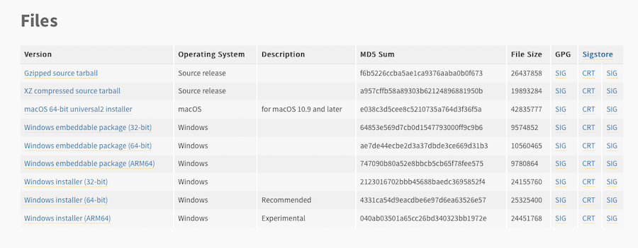
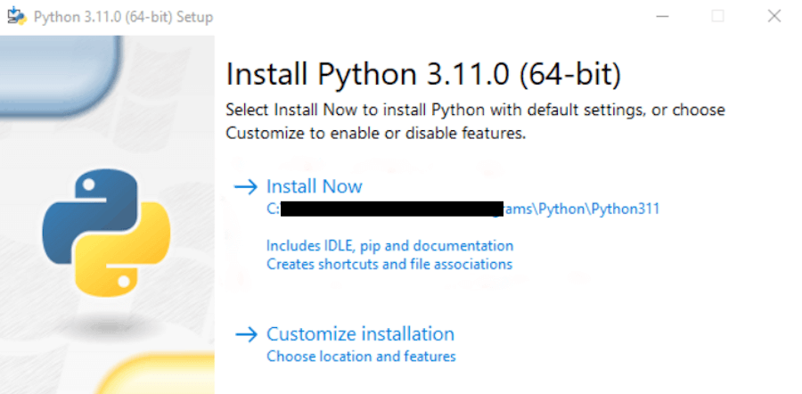
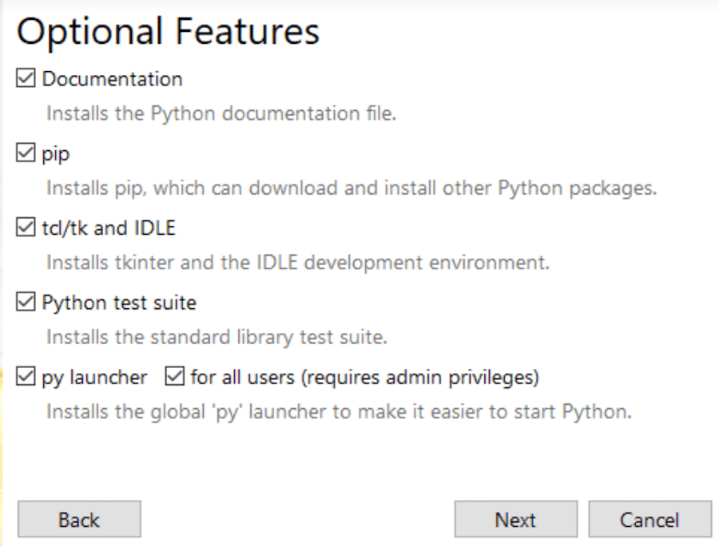
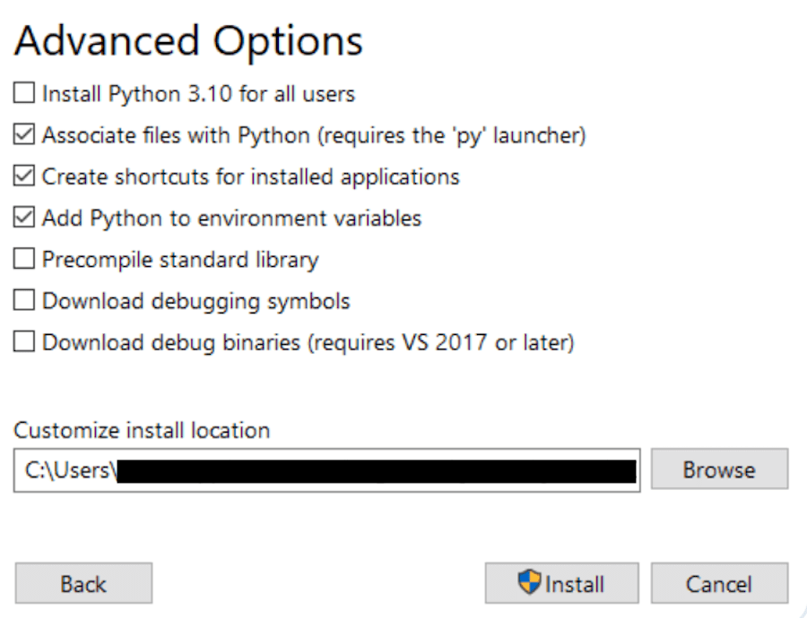
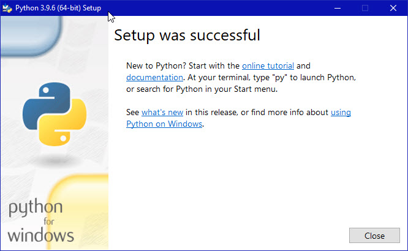

# ⚡ Python Course


# TABLE OF CONTENT

1. [Introduction to Python](#introduction-to-python)
   - [What is OOPS?](#what-is-OOPS?)
   - [Why we use OOPS?](#why-we-use-oops?)
   - [What if we don’t use OOPS?](#what-if-we-dont-use-oops?)
   - [What is Class?](#what-is-class?)
   - [What is Object and Methods?](#what-is-object-and-methods?)
2. [How to install Python](#how-to-install-python)
3. [Course Materials](#course-materials)
4. [Create a Class](#create-a-class)
5. [Type of Methods](#type-of-methods)

# Introduction to Python

**Object-Oriented Programming,** also known as OOPs concepts in python, is what lets us develop applications using an Object-Oriented approach. It does so by clubbing together similar or related behaviors and properties and converting them into objects. In this article, I will explain the basic concepts of Object-Oriented Programming in Python programming, oop fundamentals, and features of oops. You must know Python programming before you continue.

Developers often choose to use OOP concepts in Python programs because it makes code more reusable and easier to work with larger programs. OOP programs prevent you from repeating code because a class can be defined once and reused many times.

Beginners can learn Python using the free course on [Introduction to Python.](https://www.udemy.com/course/python-for-object-oriented-programming/learn/lecture/33321028#overview)

Learning Objectives

Understanding the Object Oriented Programming.
Learning and implementing different OOP concepts in python.

## What is OOPS?

- **Object-oriented programming** (OOP) is a programming paradigm that uses "objects" to design applications and computer programs. "Objects" are data structures consisting of data fields and methods together with their interactions. This makes it easier to create complex programs that are easier to maintain and reuse. OOP is based on several concepts such as **Encapsulation, Abstraction, Inheritance, and Polymorphism.**

- **Encapsulation** is the bundling of data and methods into a single unit, called an object. This bundling helps to protect the data from outside interference and makes it easier to maintain the code. For example, a class in Python can be used to encapsulate data and methods related to a particular object, such as a car. The class would contain the car's data fields, such as its make, model, and color, as well as its methods, such as accelerate() and brake().

- **Abstraction** is the act of hiding the implementation details of an object from the user. This allows the user to focus on using the object without having to worry about how it works. For example, the user of a car does not need to know how the engine works in order to drive the car. The car's engine is abstracted away from the user, and the user only needs to know how to interact with the car's controls, such as the steering wheel and the pedals.

- **Inheritance** is the ability for a new object to inherit the properties and methods of an existing object. This allows for code reuse and makes it easier to create new objects that are similar to existing objects. For example, a class for a sports car could inherit the properties and methods of a class for a car. The sports car class would then have all of the same properties and methods as the car class, plus any additional properties and methods that are specific to sports cars.

- **Polymorphism** is the ability for an object to take on many forms. This allows for code reuse and makes it easier to write code that is more flexible. For example, a function that takes a car object as an argument could be used with any type of car, such as a sports car, a sedan, or a truck. The function would be able to treat all of the different types of cars in the same way, even though they may have different properties and methods.

## Example

```python
class Car:
def **init**(self, make, model, color):
self.make = make
self.model = model
self.color = color

    def accelerate(self):
        print("The car is accelerating.")

    def brake(self):
        print("The car is braking.")

my_car = Car("Toyota", "Camry", "red")

my_car.accelerate()
my_car.brake()
```

```Output
The car is accelerating.
The car is braking.
```

## Why we use OOPS?

Overall, OOP is a powerful programming paradigm that can help us to write better code. It is a good choice for Python developers because it is well-supported by the language and because it can help us to write code that is **modular, reusable, secure, maintainable, concise, flexible, and easy to understand.**

- ### Modularity:

  OOP allows us to break down our code into smaller, more manageable pieces, called objects. This makes it easier to write, maintain, and debug our code.

- ### Reusability:

  OOP allows us to reuse our code by creating classes and objects. We can then use these classes and objects to create new programs without having to rewrite the same code over and over again.

- ### Encapsulation:

  OOP allows us to hide the implementation details of our code from other parts of our program. This makes our code more secure and easier to maintain.

- ### Abstraction:

  OOP allows us to create abstract representations of real-world objects. This makes our code more concise and easier to understand.

- ### Inheritance:

  OOP allows us to create new classes that inherit the properties and methods of existing classes. This makes it easier to create new programs that are similar to existing programs.

- ### Polymorphism:

  OOP allows us to write code that can be used with different types of objects. This makes our code more flexible and reusable.

## What if we don’t use OOPS?

It is not necessary to use OOP concepts in Python. Python is a general-purpose programming language that can be used for a variety of tasks, including procedural programming, functional programming, and object-oriented programming. However, OOP is a very popular programming paradigm, and many Python libraries and frameworks are designed to be used with OOP.

If you are writing a small, simple Python program, you may not need to use OOP concepts. However, if you are writing a large, complex Python program, you may find that OOP concepts can help you to organize your code and make it more maintainable and reusable.

**Here are some of the consequences of not using OOP concepts in Python:**

- Your code may be more difficult to organize and maintain.
- Your code may be less reusable.
- You may not be able to take advantage of some Python libraries and frameworks.
- Your code may be less efficient.

**However, there are also some advantages to not using OOP concepts in Python:**

- Your code may be simpler and easier to understand.
- You may be able to write your code more quickly.
- You may have more control over the way your code works.

Ultimately, the decision of whether or not to use OOP concepts in Python is a trade-off between the benefits and drawbacks. If you are unsure whether or not to use OOP concepts, it is a good idea to talk to an experienced Python developer.

## What is Class?

A class is a code template for creating objects. A class is a blueprint for creating objects.Objects have member variables and have behaviour associated with them. In python a class is created by the keyword class . An object is created using the constructor of the class.

## What is Object and Methods?

In Python, everything is an object. An object is a data structure consisting of data fields and methods. Methods are functions that belong to objects. They are used to define the behavior of an object.

### Example program

```python
    class Person:

    def **init**(self, name, age):
    self.name = name
    self.age = age

    def greet(self):
    print(f"Hello, my name is {self.name} and I am {self.age} years old.")

    p1 = Person("John", 36)
    p1.greet()
```

```
Hello, my name is John and I am 36 years old.
```

- In this example, we create a class called Person. This class has two attributes: name and age. It also has a method called greet().

- We then create an object of the Person class called p1. We pass the values "John" and 36 to the **init**() method of the Person class.

- Finally, we call the greet() method on the p1 object. This prints the message "Hello, my name is John and I am 36 years old." to the console.

- We can also use methods to modify the data fields of an object. For example, we could add a method to the Person class called set_age().

- This method would take a new age as an argument and update the age attribute of the object.

### Example

```Python
class Person:
  def __init__(self, name, age):
    self.name = name
    self.age = age

  def greet(self):
    print(f"Hello, my name is {self.name} and I am {self.age} years old.")

  def set_age(self, new_age):
    self.age = new_age

  p1 = Person("John", 36)
  p1.set_age(37)
  p1.greet()
```

```
Hello, my name is John and I am 37 years old.
```

In this example, we create a Person object called p1 and set its age to 36. We then call the set_age() method on the p1 object to update its age to 37. Finally, we call the greet() method on the p1 object. This prints the message "Hello, my name is John and I am 37 years old." to the console.

Methods are a powerful way to define the behavior of objects in Python. They allow us to create reusable code that can be used to manipulate the data fields of objects.

## Difference between Methods and Functions?

In Python, methods and functions have similar purposes but differ in important ways. Functions are independent blocks of code that can be called from anywhere, while methods are tied to objects or classes and need an object or class instance to be invoked.

| Parameter   | Method                                                    | Function                                                         |
| ----------- | --------------------------------------------------------- | ---------------------------------------------------------------- |
| Definition  | Method definitions are always present inside a class.     | No class is needed to define a function.                         |
| Association | Associated with the class object.                         | Not associated with any objects.                                 |
| Call        | It is called on an object.                                | It is called by its name.                                        |
| Dependency  | It depends on the class they belong to.                   | It doesn’t depend on any class, i.e., it is an identical entity. |
| self        | It requires the self as its first argument.               | It doesn’t require any self-argument.                            |
| operation   | It operates on the data of the object it associates with. | It operates on the data that you pass to them as an argument.    |

# How to install Python

**Step 1: Download the Python installer**

Visit the [official Python website](https://www.python.org/downloads/windows/) and download the latest version of Python 3.x for Windows. The website will automatically detect your operating system and offer the appropriate installer for your system (32-bit or 64-bit).



**Step 2: Run the Installer**

Locate the downloaded installer file (usually in your **Downloads** folder) and double-click on it to run the installation process. You may be prompted by the User Account Control (UAC) to allow the installation. Click Yes to proceed.

**Step 3: Customize the Installation (Optional)**
On the installer’s welcome screen, you’ll see two options: **Install Now** and \*\*Customize installation\*\*.

If you want to install Python with the default settings, simply click **Install Now**.



If you want to customize the installation (changing the installation directory or selecting specific components, for instance), click Customize installation. You should see the following:



Pick and choose what you’d like to be installed alongside the base installation. Your options include:

- **Documentation**: This includes the Python documentation file with the installation.

- **pip**: This option installs pip, which allows you to install other Python packages as you’d like.

- **tcl/tk and IDLE**: This option installs tkinter and IDLE.

- **Python test suite**: Selecting this option installs the standard library test suite, which is useful for testing your output.

- **py launcher; for all users**: These two options make it so you can launch Python from the command line

When you’re done making your selections, **click Next**.

You’ll be then taken to a new dialog box that offers advanced options:



Again, you’re presented with a number of options to choose from, including:

Install Python 3.11 for all users
Associate files with Python (requires the ‘py’ launcher)
Create shortcuts for installed applications
Add Python to environment variables
Precompile standard library
Download debugging symbols
Download debug binaries (requires VS 2017 or later)
Verify that the installation directory chosen is correct and then you’re reading to install.

**Step 4: Install Python**

After selecting your desired installation settings, click **Install** to begin the installation process. The installer will copy the necessary files to your computer and set up Python. This process may take a few minutes.



**Step 5: Verify the installation**

Once the installation is complete, you can verify that Python has been installed correctly by opening the Command Prompt (search for “cmd” in the **Start** menu) and typing the following command:

> `python --version`

Press Enter, and you should see the version of Python you installed displayed in the output. This confirms that Python has been successfully installed on your computer.

# Course Materials

## Classes & Objects

- Python is an object oriented programming language.

- Almost everything in Python is an object, with its properties and methods.

- A Class is like an object constructor, or a "blueprint" for creating objects.

# Create a Class

To create a class, use the keyword **class**:

### Example

> Create a class named MyClass, with a property named x:

    class MyClass:
    x = 5

## Create your first class with OOP

Creating a new class creates a new type of object, which allows the new instances of that type to be made. Each class instance has attributes attached so that it can maintain its state. Class instances can also have methods that are defined by their class for modifying their state.

```python
class Person:
  def __init__(self, name, age):
    self.name = name
    self.age = age

  def greet(self):
    print(f"Hello, my name is {self.name} and I am {self.age} years old.")

p = Person("John", 36)
p.greet()
```

```
Hello, my name is John and I am 36 years old.
```

## Classes in detail

- **Classes**: are used to create objects.
  Classes contain data and methods.

- **Data**: is stored as attributes.

- **Methods**: are functions that act on the data.

- Classes are defined using the class keyword.

- Classes can have constructors, which are special methods that are called when an object is created.

- Classes can have inheritance, which means that they can inherit data and methods from other classes.

## Exercise on class

- Create a class called Person with the following attributes:
  name, age, and country.

- Implement a method called greet() that prints a greeting to the person, including their name and age.

- Create an instance of the Person class and call the greet() method.

Here is an example of how to implement the **Person** class:

Example Program

```python
class Person:
    def __init__(self, name, age, country):
        self.name = name
        self.age = age
        self.country = country

    def greet(self):
        print(f"Hello, my name is {self.name} and I am {self.age} years old. I am from {self.country}.")

# Create an instance of the Person class
person = Person("John Doe", 30, "USA")

# Call the greet() method
person.greet()
```

```
Hello, my name is John Doe and I am 30 years old. I am from USA.
```

## Methods

In Python, methods are functions that are defined inside a class. They are used to perform actions on the objects of that class. Methods can be either instance methods or class methods.

Instance methods are the most common type of methods. They are associated with an object of a class and can access and modify the data stored within that object. Instance methods are defined using the def keyword, followed by the method name and a pair of parentheses. Inside the parentheses, you can specify any parameters that the method needs.

Here is an example of an instance method:

```python
class Person:
    def __init__(self, name, age):
        self.name = name
        self.age = age

    def greet(self):
        print(f"Hello, my name is {self.name} and I am {self.age} years old.")

p = Person("Alice", 25)
p.greet()
```

```
Hello, my name is Alice and I am 25 years old.
```

Class methods are associated with the class itself, rather than an instance of the class. They can access and modify class-level data. Class methods are defined using the @classmethod decorator.

Here is an example of a class method:

```python
class Person:
    @classmethod
    def from_string(cls, string):
        name, age = string.split(",")
        return cls(name, age)

p = Person.from_string("Alice, 25")
print(p.name)
```

```
Alice
```

Static methods are similar to functions outside of a class. They cannot access any instance or class data. Static methods are defined using the @staticmethod decorator.

Here is an example of a static method:

```Python
class Person:
    @staticmethod
    def is_adult(age):
        return age >= 18

p = Person("Alice", 25)
print(Person.is_adult(p.age))
```

```
True
```

## Exercise on methods

1.Write a Python function to find the maximum of three numbers.

Here is an example of how to write a function to find the maximum of three numbers:

```Python
def max_of_three(a, b, c):
"""Return the maximum of three numbers."""
if a > b:
if a > c:
return a
else:
return c
else:
if b > c:
return b
else:
return c

print(max_of_three(1, 2, 3))
```

```
3
```

This function takes three numbers as input and returns the maximum of the three numbers. The function first compares the first two numbers and returns the larger of the two numbers. Then, the function compares the larger of the two numbers to the third number and returns the larger of the two numbers.

2.Write a Python function to sum all the numbers in a list.

Here is an example of how to write a function to sum all the numbers in a list:

```Python
def sum_list(numbers):
"""Return the sum of all the numbers in a list."""
sum = 0
for number in numbers:
sum += number
return sum

print(sum_list([1, 2, 3, 4, 5]))
```

```
15
```

This function takes a list of numbers as input and returns the sum of all the numbers in the list. The function iterates over the list and adds each number to the sum. Finally, the function returns the sum.

3.Write a Python function to multiply all the numbers in a list.

Here is an example of how to write a function to multiply all the numbers in a list:

```Python
def multiply_list(numbers):
"""Return the product of all the numbers in a list."""
product = 1
for number in numbers:
product \*= number
return product

print(multiply_list([1, 2, 3, 4, 5]))
```

```
120
```

This function takes a list of numbers as input and returns the product of all the numbers in the list. The function iterates over the list and multiplies each number by the product. Finally, the function returns the product.

4.Write a Python program to reverse a string.

Here is an example of how to write a program to reverse a string:

```Python
def reverse_string(string):
"""Return the reverse of a string."""
reversed_string = ""
for i in range(len(string) - 1, -1, -1):
reversed_string += string[i]
return reversed_string

print(reverse_string("hello"))
```

```
olleh
```

This program takes a string as input and returns the reverse of the string. The program iterates over the string in reverse order and appends each character to the reversed string. Finally, the program returns the reversed string.

These are just a few examples of exercises on methods in Python. There are many other exercises that you can find online or in books.

## Class Variable

Class variables are defined within the class construction. Because they are owned by the class itself, class variables are shared by all instances of the class. They therefore will generally have the same value for every instance unless you are using the class variable to initialize a variable.

Here is an example of a class variable in Python:

```python
class MyClass:
  # Class variable
  num_instances = 0

  def __init__(self):
    # Instance variable
    self.name = "John"

    # Increment class variable
    MyClass.num_instances += 1

# Create two instances of the class
my_class1 = MyClass()
my_class2 = MyClass()

# Print the class variable
print(MyClass.num_instances)
```

```
2
```

As you can see, the class variable num_instances is shared by all instances of the class. It is incremented each time a new instance is created.

Here is another example:

```python
class MyClass:
  # Class variable
  school_name = "Stanford University"

  def __init__(self, name):
    # Instance variable
    self.name = name

# Create two instances of the class
my_class1 = MyClass("John")
my_class2 = MyClass("Mary")

# Print the class variable
print(MyClass.school_name)
```

```
Stanford University
```

In this example, the class variable school_name is also shared by all instances of the class. It is used to store the name of the school that the students attend.

Class variables can be useful for storing data that is shared by all instances of a class. For example, you could use a class variable to store the number of students in a class, or the name of the school that the students attend.

## Object techniques and Class Variable

Objects do not share instance variables. Every object has its copy of the instance attribute. Class Variables: A class variable is a variable that is declared inside of a class but outside of any instance method or init() method. Class variables are shared by all instances of a class.

Here are some object techniques and class variable examples in Python:

- Instance variables: Instance variables are specific to an instance of a class, meaning each object created from a class has its own separate set of instance variables, with unique values for each instance. For example:

```Python
class Person:
  def __init__(self, name, age):
    self.name = name
    self.age = age

p1 = Person("Alice", 25)
p2 = Person("Bob", 30)

print(p1.name)
print(p2.name)
```

- Class variables: Class variables are shared across all instances (objects) of a class. They belong to the class itself, not to any specific instance. For example:

```python
class Person:
  num_people = 0

  def __init__(self, name, age):
    self.name = name
    self.age = age
    Person.num_people += 1

p1 = Person("Alice", 25)
p2 = Person("Bob", 30)

print(Person.num_people)
```

- Static methods: Static methods are methods that are bound to a class, not to an instance. They are typically used for utility functions that are related to the class, but do not need to operate on an instance of the class. For example:

```Python
class Person:
  @staticmethod
  def greet():
    print("Hello, world!")

Person.greet()  # "Hello, world!"
```

- Class methods: Class methods are methods that are bound to a class, but can also be called on an instance of the class. They are typically used for factory methods or other methods that need to operate on the class itself, rather than on an instance of the class. For example:

```Python
class Person:
  @classmethod
  def from_string(cls, string):
    name, age = string.split(",")
    return cls(name, age)

p1 = Person.from_string("Alice, 25")
print(p1.name)  # "Alice"
```

These are just a few examples of object techniques and class variables in Python. There are many other techniques and variables that can be used to create powerful and flexible object-oriented programs.

## Issue in class

Here are some issues that can occur when working with classes in Python:

- NameError: This error occurs when the class name is not defined.

- TypeError: This error occurs when the class is not defined or the class does not have the attribute or method that is being called.

- AttributeError: This error occurs when the class has the attribute or method, but it is not accessible.

- SyntaxError: This error occurs when the class definition is not syntactically correct.

- IndentationError: This error occurs when the class definition is not indented correctly.

Here are some tips for avoiding these issues:
Make sure that the class name is defined and spelled correctly.

- Make sure that the class has the attribute or method that is being called.

- Make sure that the attribute or method is accessible.

- Make sure that the class definition is syntactically correct.

- Make sure that the class definition is indented correctly.

If you are still having trouble, you can try searching for help online or asking a question on a Python forum.

Here are some examples of class issues in Python:

```python
# NameError: name 'Circle' is not defined
class Circle:
    pass

# TypeError: 'Circle' object is not callable
Circle()

# AttributeError: 'Circle' object has no attribute 'radius'
c = Circle()
c.radius

# SyntaxError: invalid syntax
class Circle
    pass
    radius = 5

# IndentationError: expected an indented block
class Circle:
    pass
    radius = 5
```

These errors can be avoided by following the tips above.

# Type of Methods

In this article, Python methods are functions associated with objects, categorized into instance, class, and static methods. They allow manipulation and interaction with object data. Attributes describe object characteristics.

## Instance methods

Here are the 3 types of methods in Python:

Instance methods: are the most common type of method.
They are associated with an instance of a class and can modify the data stored within the instance. To call an instance method, you must first create an instance of the class. Then, you can call the method on the instance.

Here's an example of an instance method:

```Python
class MyClass:
  def __init__(self, name):
    self.name = name

  def print_name(self):
    print(self.name)

my_instance = MyClass("John")
my_instance.print_name()
```

```
John
```

## Class methods

Class methods: are associated with the class rather than an instance and can access and modify class-level data. To call a class method, you do not need to create an instance of the class. You can simply call the method on the class itself.

Here's an example of a class method:

```Python
class MyClass:
  @classmethod
  def create_instance(cls, name):
    return cls(name)

my_instance = MyClass.create_instance("John")
my_instance.print_name()
```

```
John
```

## Static methods

Static methods: are similar to functions outside of the class and cannot access any instance or class data. To call a static method, you do not need to create an instance of the class. You can simply call the method on the class itself.

Here's an example of a static method:

```Python
class MyClass:
  @staticmethod
  def add_numbers(a, b):
    return a + b

print(MyClass.add_numbers(1, 2))
```

```
3
```

These are the three types of methods in Python. Each type of method has its own purpose and can be used in different situations
